---
## Front matter
lang: ru-RU
title: Лабораторная работа №3
subtitle: Введение в работу с Octave
author:
  - Смирнов-Мальцев Е. Д.
institute:
  - Российский университет дружбы народов, Москва, Россия
date: 06 мая 2023

## i18n babel
babel-lang: russian
babel-otherlangs: english

## Formatting pdf
toc: false
toc-title: Содержание
slide_level: 2
aspectratio: 169
section-titles: true
theme: metropolis
header-includes:
 - \metroset{progressbar=frametitle,sectionpage=progressbar,numbering=fraction}
 - '\makeatletter'
 - '\beamer@ignorenonframefalse'
 - '\makeatother'
---

# Информация

## Докладчик

  * Смирнов-Мальцев Егор Дмитриевич
  * студент группы НКНбд-01-21
  * Российский университет дружбы народов

---

# Цель работы

Научиться выполнять основные вычисления и рисовать простейшие двумерные графики с помощью системы для математических вычислений Oсtave.

---

# Задание

- Выполнить простейшие операции.
- Выполнить операции с векторами.
- Выполнить матричные операции.
- Построить простейшие графики.
- Сравнить циклы и операции с векторами

---

# Выполнение лабораторной работы

Включим журналирование с помощью diary on. Затем воспользуемся  Octave как простейшим калькулятором, вычислив выражение $2*6 + (7-4)^2$

# 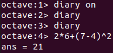

---

# Выполнение лабораторной работы

Зададим вектор-строку $u$. Затем создадим вектор-столбец $u$ и матрицу $A$. Зададим ещё один вектор-столбец $v$ и посчитаем $2*v+3*u$. Перемножим эти векторы скалярно с помощью функции dot() и векторно с помощью функции cross(). Также найдём норму этих векторов функцией norm()

# 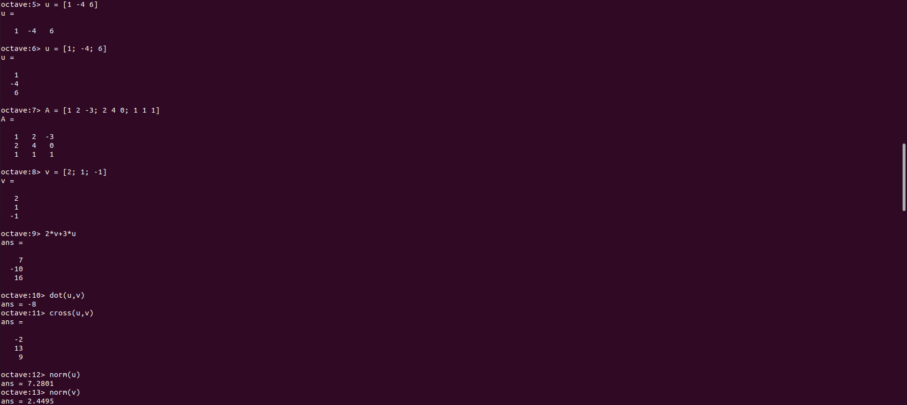

---

# Выполнение лабораторной работы

Введём два новых вектора-строки $u$ и $v$ и вычислим проекцию вектора $u$ на вектор $v$:

# 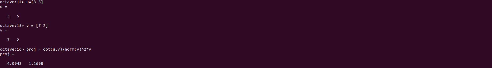

---

# Выполнение лабораторной работы

Введём матрицу $B$. Вычислим $A*B$, $B^T*A$

# 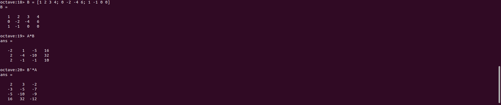

---

# Выполнение лабораторной работы

Вычислим $2*A-4*I$, где I единичная матрица. Затем найдём определитель матрицы А, обратную ей матрицу, собственные значения и ранг матрицы A

# 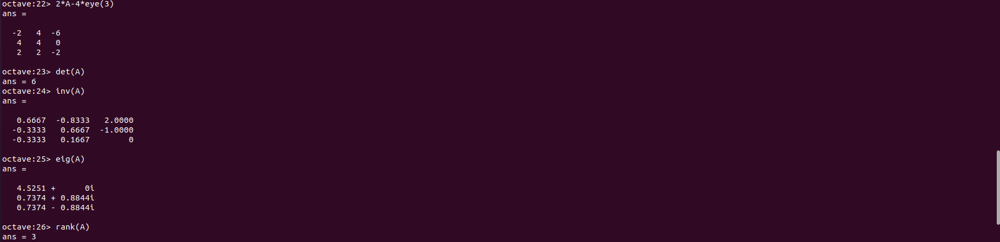

---

# Выполнение лабораторной работы

Создадим вектор значений $x$, зададим вектор $y = sinx$ и построим график

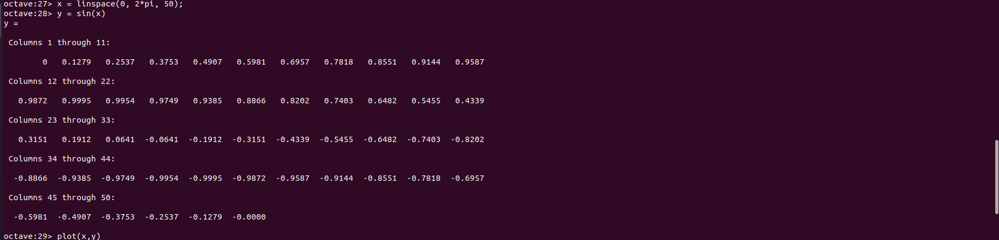 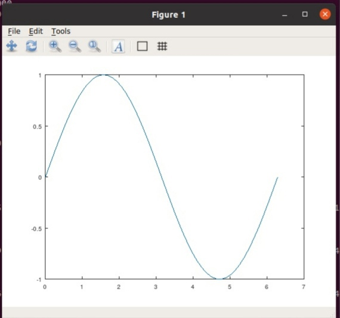

---

# Выполнение лабораторной работы

Улучшим внешний вид графика. Изменим цвет и ширину линии, подгоним диапазон осей, нарисуем сетку, подпишем оси, сделаем заголовок графика и зададим легенду

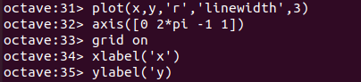 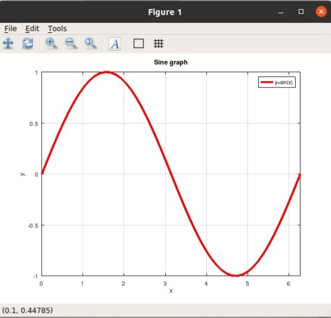

---

# Выполнение лабораторной работы

Начертим два графика на одном чертеже. Очистим память и рабочую область фигуры. Зададим два вектора и начертим эти точки, используя кружочки как маркеры. Чтобы добавить к нашему текущему графику ещё один, используем команду hold on. Добавим график регрессии, зададим сетку, оси и легенду.

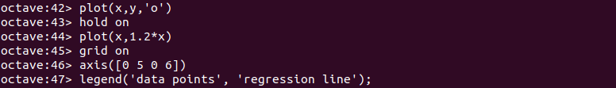 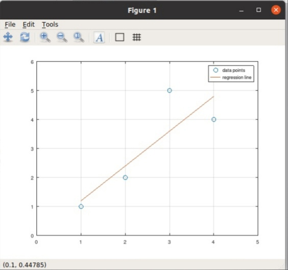

---

# Выполнение лабораторной работы

Очистим память и рабочую область фигуры. Создадим вектор $x$ и попробуем построить график $y = x^2*sin(x)$. С помощью команды `plot(x, x^2*sin(x))` сделать это не получится, так как ей задаётся матричное умножение, а нам нужно поточечное. Сохраним графики в виде файлов, в результате получим следующий график

# 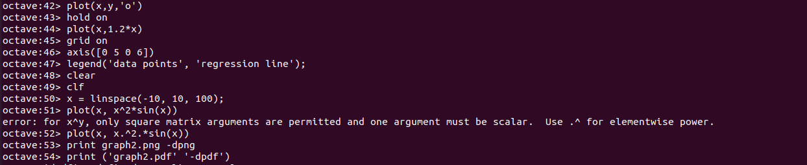 

---

# Выполнение лабораторной работы

Сравним эффективность работы с циклами и операций с векторами. Для этого вычислим
сумму 
$$
\sum_{n}^{10000000} 1/n^2
$$
с помощью цикла (программа loop_for.m) и с помощью операций с векторами (программа loop_vec.m). При сравнении обнаружим, что вычисление через векторы значительно быстрее.

# 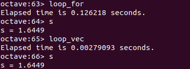

---

# Выводы

В результате выполнения работы научились выполнять основные вычисления и рисовать простейшие двумерные графики с помощью системы Octave.

---

# Список литературы

1. GNU Octave [Электронный ресурс]. Free Software Foundation, 2023. URL:
https://octave.org/.
2. GNU Octave Documentation [Электронный ресурс]. Free Software Foundation, 2023. URL: https://docs.octave.org/latest/.
