---
## Front matter
title: "Лабораторная работа №3"
subtitle: "Введение в работу с Octave"
author: "Смирнов-Мальцев Егор Дмитриевич"

## Generic otions
lang: ru-RU
toc-title: "Содержание"

## Bibliography
bibliography: bib/cite.bib
csl: pandoc/csl/gost-r-7-0-5-2008-numeric.csl

## Pdf output format
toc: true # Table of contents
toc-depth: 2
lof: true # List of figures
lot: false # List of tables
fontsize: 12pt
linestretch: 1.5
papersize: a4
documentclass: scrreprt
## I18n polyglossia
polyglossia-lang:
  name: russian
  options:
	- spelling=modern
	- babelshorthands=true
polyglossia-otherlangs:
  name: english
## I18n babel
babel-lang: russian
babel-otherlangs: english
## Fonts
mainfont: PTSerif
romanfont: PTSerif
sansfont: PTSans
monofont: PTMono
mainfontoptions: Ligatures=TeX
romanfontoptions: Ligatures=TeX
sansfontoptions: Ligatures=TeX,Scale=MatchLowercase
# monofontoptions: Scale=MatchLowercase,Scale=0.9
## Biblatex
biblatex: true
biblio-style: "gost-numeric"
biblatexoptions:
  - parentracker=true
  - backend=biber
  - hyperref=auto
  - language=auto
  - autolang=other*
  - citestyle=gost-numeric
## Pandoc-crossref LaTeX customization
figureTitle: "Рис."
tableTitle: "Таблица"
listingTitle: "Листинг"
lofTitle: "Список иллюстраций"
lotTitle: "Список таблиц"
lolTitle: "Листинги"
## Misc options
indent: true
header-includes:
  - \usepackage{indentfirst}
  - \usepackage{float} # keep figures where there are in the text
  - \floatplacement{figure}{H} # keep figures where there are in the text
---

# Цель работы

Научиться выполнять основные вычисления и рисовать простейшие двумерные графики с помощью системы для математических вычислений Oсtave.

# Задание

- Выполнить простейшие операции.
- Выполнить операции с векторами.
- Выполнить матричные операции.
- Построить простейшие графики.
- Сравнить циклы и операции с векторами

# Теоретическое введение

GNU Octave — это система математических вычислений, использующая совместимый с MATLAB язык высокого уровня [@octave:bash].

По заявлениям разработчиков данная программа обладает следующими свойствами[]:

- Мощный синтаксис, ориентированный на математику, со встроенными инструментами 2D/3D-графики и визуализации.
- Бесплатное программное обеспечение, работающее на GNU/Linux, macOS, BSD и Microsoft Windows.
- Вставка, совместимая со многими скриптами Matlab

# Выполнение лабораторной работы

Включим журналирование с помощью diary on. Затем воспользуемся  Octave как простейшим калькулятором, вычислив выражение $2*6 + (7-4)^2$(рис. [-@fig:001])

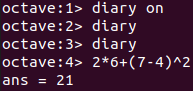{ #fig:001 width=70% }

Зададим вектор-строку $u$. Затем создадим вектор-столбец $u$ и матрицу $A$. Зададим ещё один вектор-столбец $v$ и посчитаем $2*v+3*u$. Перемножим эти векторы скалярно с помощью функции dot() и векторно с помощью функции cross(). Также найдём норму этих векторов функцией norm() (рис. [-@fig:002])

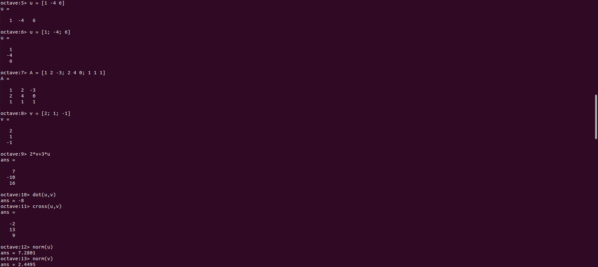{ #fig:002 width=70% }

Введём два новых вектора-строки $u$ и $v$ и вычислим проекцию вектора $u$ на вектор $v$ (рис. [-@fig:003]):

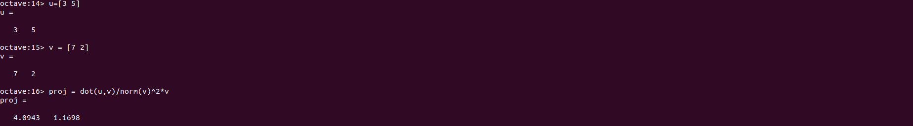{ #fig:003 width=70% }

Введём матрицу $B$. Вычислим $A*B$, $B^T*A$ (рис. [-@fig:004])

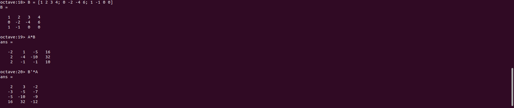{ #fig:004 width=70% }

Вычислим $2*A-4*I$, где I единичная матрица. Затем найдём определитель матрицы А, обратную ей матрицу, собственные значения и ранг матрицы A (рис. [-@fig:005])

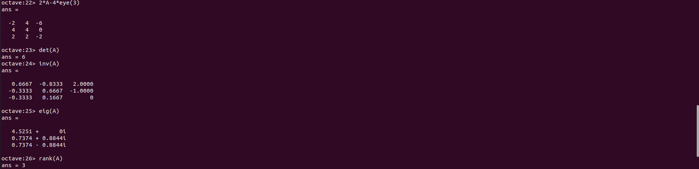{ #fig:005 width=70% }

Создадим вектор значений $x$, зададим вектор $y = sinx$ и построим график (рис. [-@fig:006], [-@fig:007])

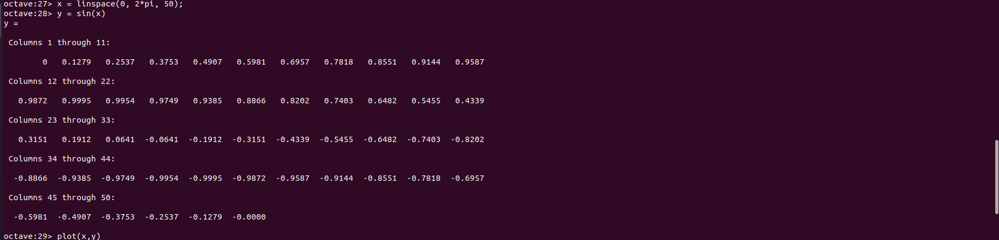{ #fig:006 width=70% }

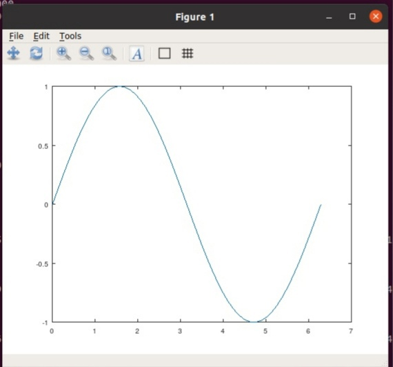{ #fig:007 width=70% }

Улучшим внешний вид графика. Изменим цвет и ширину линии, подгоним диапазон осей, нарисуем сетку, подпишем оси, сделаем заголовок графика и зададим легенду (рис. [-@fig:008], [-@fig:009])

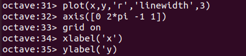{ #fig:008 width=70% }

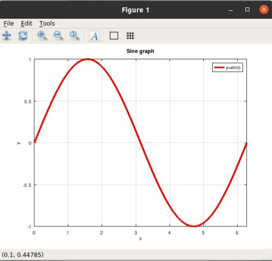{ #fig:009 width=70% }

Начертим два графика на одном чертеже. Очистим память и рабочую область фигуры. Зададим два вектора и начертим эти точки, используя кружочки как маркеры. Чтобы добавить к нашему текущему графику ещё один, используем команду hold on. Добавим график регрессии, зададим сетку, оси и легенду. (рис. [-@fig:010], [-@fig:011])

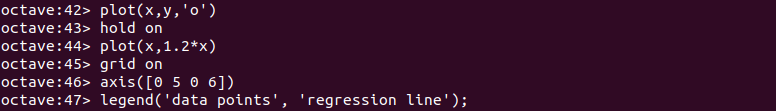{ #fig:010 width=70% }

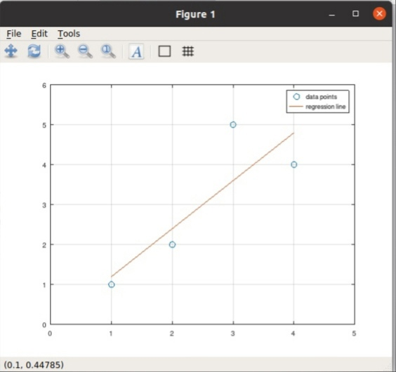{ #fig:011 width=70% }

Очистим память и рабочую область фигуры. Создадим вектор $x$ и попробуем построить график $y = x^2*sin(x)$. С помощью команды `plot(x, x^2*sin(x))` сделать это не получится, так как ей задаётся матричное умножение, а нам нужно поточечное. Сохраним графики в виде файлов, в результате получим следующий график (рис. [-@fig:012], [-@fig:013])

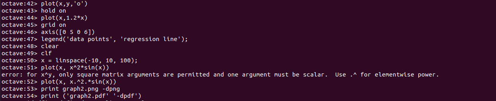{ #fig:012 width=70% }

{ #fig:013 width=70% }

Сравним эффективность работы с циклами и операций с векторами. Для этого вычислим
сумму 
$$
\sum_{n}^{10000000} 1/n^2
$$
с помощью цикла (программа loop_for.m) и с помощью операций с векторами (программа loop_vec.m). При сравнении обнаружим, что вычисление через векторы значительно быстрее. (рис. [-@fig:014])

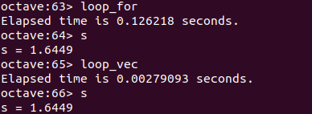{ #fig:014 width=70% }

# Выводы

В результате выполнения работы научились выполнять основные вычисления и рисовать простейшие двумерные графики с помощью системы Octave.

# Список литературы{.unnumbered}

::: {#refs}
:::
