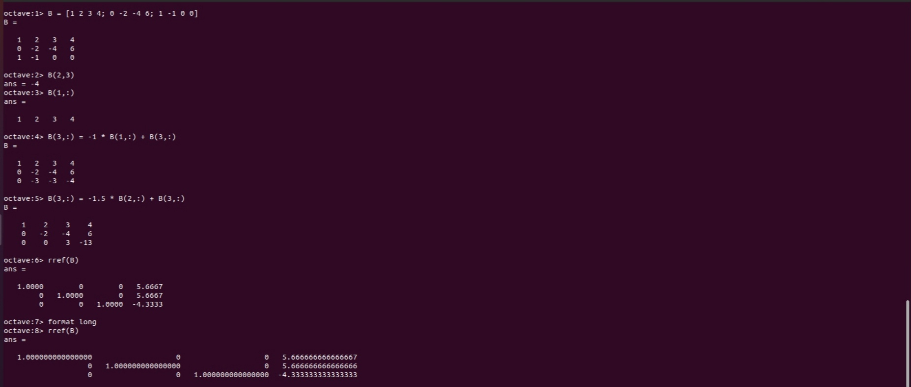
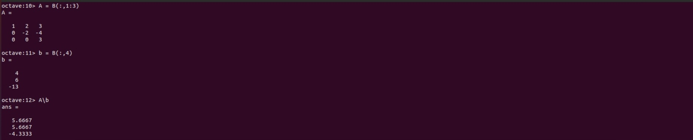
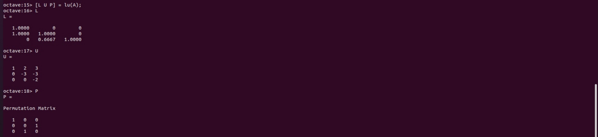

---
## Front matter
lang: ru-RU
title: Лабораторная работа №4
subtitle: Введение в работу с Octave
author:
  - Смирнов-Мальцев Е. Д.
institute:
  - Российский университет дружбы народов, Москва, Россия
date: 12 мая 2023

## i18n babel
babel-lang: russian
babel-otherlangs: english

## Formatting pdf
toc: false
toc-title: Содержание
slide_level: 2
aspectratio: 169
section-titles: true
theme: metropolis
header-includes:
 - \metroset{progressbar=frametitle,sectionpage=progressbar,numbering=fraction}
 - '\makeatletter'
 - '\beamer@ignorenonframefalse'
 - '\makeatother'

style: |
  section h2 {
    text-align: center;
  }

---

# Информация

## Докладчик

  * Смирнов-Мальцев Егор Дмитриевич
  * студент группы НКНбд-01-21
  * Российский университет дружбы народов

---

# Цель работы

Научиться выполнять основные вычисления и рисовать простейшие двумерные графики с помощью системы для математических вычислений Oсtave.

---

# Задание

- Выполнить простейшие операции.
- Выполнить операции с векторами.
- Выполнить матричные операции.
- Построить простейшие графики.
- Сравнить циклы и операции с векторами

---

# Выполнение лабораторной работы

Введем расширенную матрицу уравнения. Вручную распишем метод Гаусса. Также решим эту СЛАУ с помощью стандартной функции в Octave. Для увеличения количества показанных знаков после запятой используем команду `format long`.

## 

---

# Выполнение лабораторной работы

Встроенная операция для решения линейных систем вида $Ax = b$
в Octave называется левым делением и записывается как A\b. Это эквивалентно выражению $A^{-1}b$

## 

---

# Выполнение лабораторной работы

С помощью функции lu() в Octave распишем LUP-разложение матрицы A:

## 

---

# Выводы

В результате выполнения работы научились решать системы линейных уравнениий с помощью системы для математических вычислений Oсtave.

---

# Список литературы

1. Метод Гаусса [Электронный ресурс]. Wikimedia Foundation, Inc., 2023. URL:
https://ru.wikipedia.org/wiki/%D0%9C%D0%B5%D1%82%D0%BE%D0%B4_%
D0%93%D0%B0%D1%83%D1%81%D1%81%D0%B0.
2. GNU Octave Documentation [Электронный ресурс]. Free Software Foundation, 2023. URL: https://docs.octave.org/latest/.