---
## Front matter
lang: ru-RU
title: Лабораторная работа №5
subtitle: Работа с полиномами
author:
  - Смирнов-Мальцев Е. Д.
institute:
  - Российский университет дружбы народов, Москва, Россия
date: 12 мая 2023

## i18n babel
babel-lang: russian
babel-otherlangs: english

## Formatting pdf
toc: false
toc-title: Содержание
slide_level: 2
aspectratio: 169
section-titles: true
theme: metropolis
header-includes:
 - \metroset{progressbar=frametitle,sectionpage=progressbar,numbering=fraction}
 - '\makeatletter'
 - '\beamer@ignorenonframefalse'
 - '\makeatother'

style: |
  section h2 {
    text-align: center;
  }

---

# Информация

## Докладчик

  * Смирнов-Мальцев Егор Дмитриевич
  * студент группы НКНбд-01-21
  * Российский университет дружбы народов

---

# Цель работы

Научиться подгонять полиномиальные кривые и выполнять различные матричные преобразования с помощью системы для математических вычислений Oсtave.

---

# Задание

- Выполнить подгонку полиномиальной кривой с помощью Octave.
- Представить изображение с помощью матрицы.
- Перевернуть изображение на определённый угол.
- Отразить изображение относительно прямой.
- Выполнить преобразование делитации.

---

# Выполнение лабораторной работы

Пусть нам нужно найти параболу по методу наименьших
квадратов для набора точек, заданных матрицей.

В матрице заданы значения $x$ в столбце 1 и значения $y$ в столбце 2.
Введём матрицу данных в Octave и извлечём вектора $x$ и $y$. Нарисуем точки на графике.

## 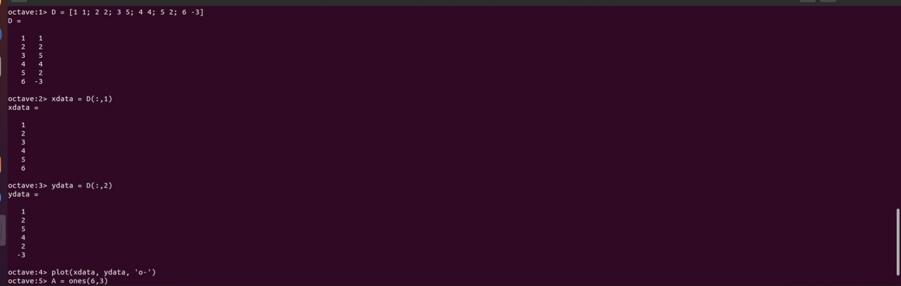 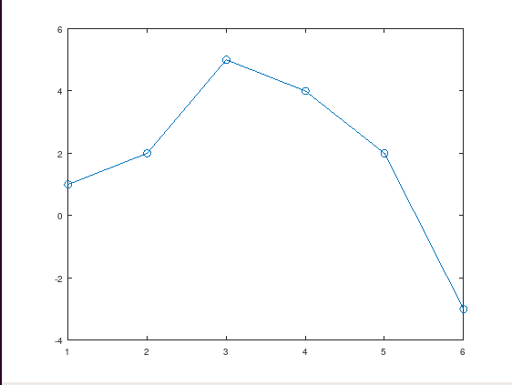

---

# Выполнение лабораторной работы

Построим уравнение вида $y = ax^2 + bx + c$

## 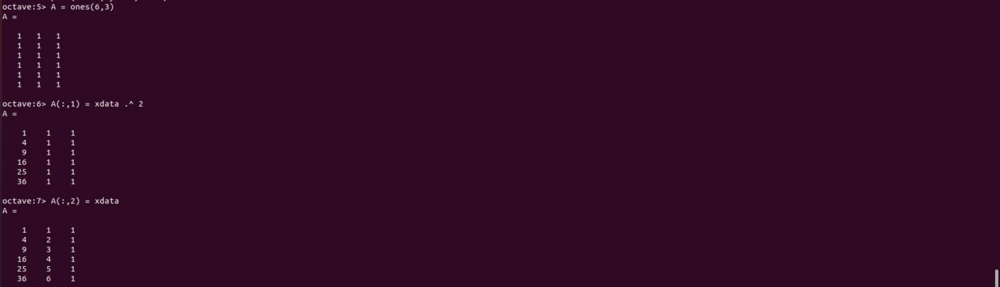

---

# Выполнение лабораторной работы

Решение по методу наименьших квадратов получается из решения уравнения $A^TAb = A^Ty$, где $b$ – вектор коэффициентов полинома. Решим его с помощью Octave. Построим график полученной параболы.

## 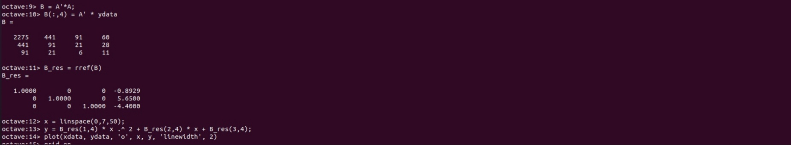 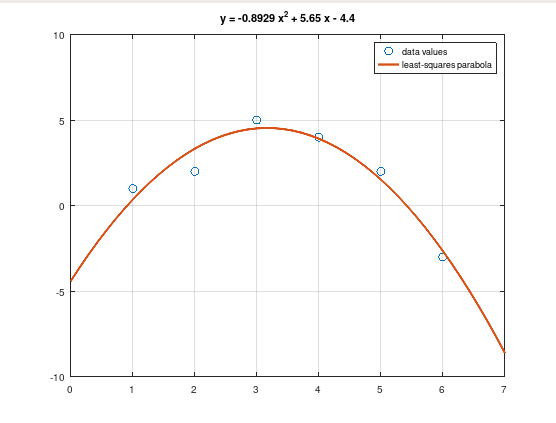

---

# Выполнение лабораторной работы

Для подгонки можно использовать встроенную функцию `polyfit`. Значения полинома $P$ в точках, задаваемых вектором-строкой x можно получить с помощью функции `polyval`.

## 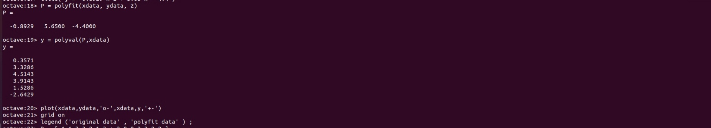

---

# Выполнение лабораторной работы

Закодируем граф-домик. Выберем путь, который проходит по каждому ребру ровно один раз. Повернем граф на 90 и 225 градусов с помощью матрицы поворота.

## 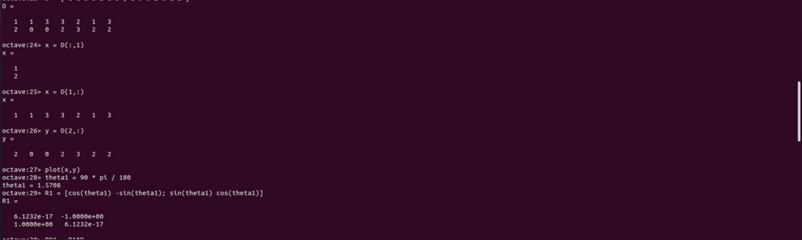 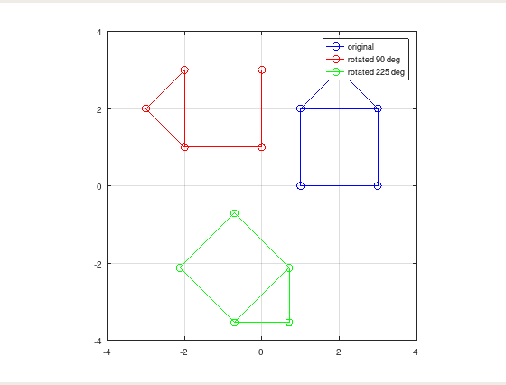

---

# Выполнение лабораторной работы

Отразим граф дома относительно прямой $y = x$. Зададим матрицу отражения, подставив угол 45 градусов, так как именно под таким углом относительно оси абсцисс проходит прямая $y = x$.

## 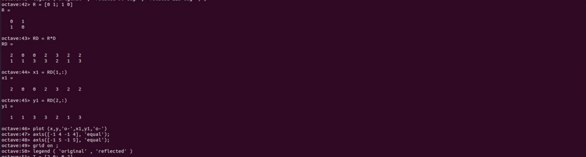 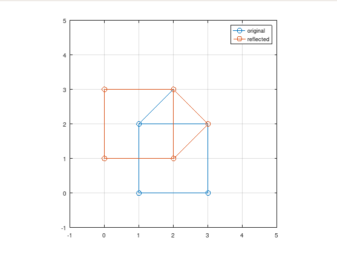

---

# Выполнение лабораторной работы

Увеличим граф дома в 2 раза, используя матрицу для делитации.

## 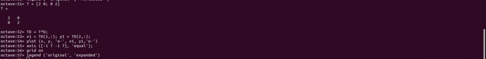 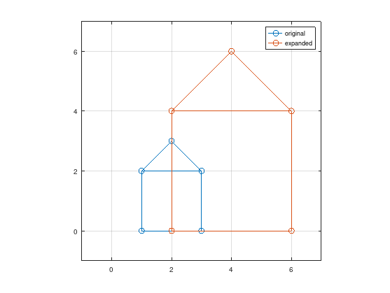

---

# Выводы

В результате выполнения работы научились подгонять полиномы и выполнять афинные преобразования графиком с помощью системы для математических вычислений Oсtave.

---

# Список литературы

1. Подгонка кривой [Электронный ресурс]. Wikimedia Foundation, Inc., 2023.
URL: https://wikipredia.net/ru/Model_fitting#cite_note-3.
2. Умнов А.Е. АНАЛИТИЧЕСКАЯ ГЕОМЕТРИЯ И ЛИНЕЙНАЯ АЛГЕБРА. МФТИ, 2011. 544 с
