---
## Front matter
title: "Лабораторная работа №5"
subtitle: "Работа с полиномами"
author: "Смирнов-Мальцев Егор Дмитриевич"

## Generic otions
lang: ru-RU
toc-title: "Содержание"

## Bibliography
bibliography: bib/cite.bib
csl: pandoc/csl/gost-r-7-0-5-2008-numeric.csl

## Pdf output format
toc: true # Table of contents
toc-depth: 2
lof: true # List of figures
lot: false # List of tables
fontsize: 12pt
linestretch: 1.5
papersize: a4
documentclass: scrreprt
## I18n polyglossia
polyglossia-lang:
  name: russian
  options:
	- spelling=modern
	- babelshorthands=true
polyglossia-otherlangs:
  name: english
## I18n babel
babel-lang: russian
babel-otherlangs: english
## Fonts
mainfont: PT Serif
romanfont: PT Serif
sansfont: PT Sans
monofont: PT Mono
mainfontoptions: Ligatures=TeX
romanfontoptions: Ligatures=TeX
sansfontoptions: Ligatures=TeX,Scale=MatchLowercase
monofontoptions: Scale=MatchLowercase,Scale=0.9
## Biblatex
biblatex: true
biblio-style: "gost-numeric"
biblatexoptions:
  - parentracker=true
  - backend=biber
  - hyperref=auto
  - language=auto
  - autolang=other*
  - citestyle=gost-numeric
## Pandoc-crossref LaTeX customization
figureTitle: "Рис."
tableTitle: "Таблица"
listingTitle: "Листинг"
lofTitle: "Список иллюстраций"
lotTitle: "Список таблиц"
lolTitle: "Листинги"
## Misc options
indent: true
header-includes:
  - \usepackage{indentfirst}
  - \usepackage{float} # keep figures where there are in the text
  - \floatplacement{figure}{H} # keep figures where there are in the text
---

# Цель работы

Научиться подгонять полиномиальные кривые и выполнять различные матричные преобразования с помощью системы для математических вычислений Oсtave.

# Задание

- Выполнить подгонку полиномиальной кривой с помощью Octave.
- Представить изображение с помощью матрицы.
- Перевернуть изображение на определённый угол.
- Отразить изображение относительно прямой.
- Выполнить преобразование делитации.

# Теоретическое введение

**Подгонка кривой** — это построение математической функции, которая наилучшим образом соответствует имеющимся данным[@wiki:bash].

Поворот происходит путем домножения координат точки на матрицу поворота:

$$\begin{pmatrix}
cos(\theta)& -sin(\theta)\\
sin(\theta)& cos(\theta) \\
\end{pmatrix}$$

**Дилатация** (то есть расширение или сжатие) также может быть выполнено
путём умножения матриц. Матричное произведение $TD$ будет преобразованием дилатации
$D$ с коэффициентом $k$, где

$$\begin{pmatrix}
k &0\\
0 &k \\
\end{pmatrix}$$

# Выполнение лабораторной работы

Пусть нам нужно найти параболу по методу наименьших
квадратов для набора точек, заданных матрицей

$$ D =
\begin{pmatrix}
1 &1\\
2 &2 \\
3 &5 \\
4 &4 \\
5 &2 \\
6 &-3 \\
\end{pmatrix}$$

В матрице заданы значения $x$ в столбце 1 и значения $y$ в столбце 2.
Введём матрицу данных в Octave и извлечём вектора $x$ и $y$. Нарисуем точки на графике.(рис. [-@fig:001], [-@fig:002])

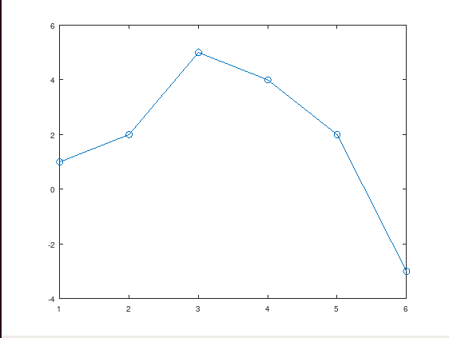{ #fig:001 width=70% }
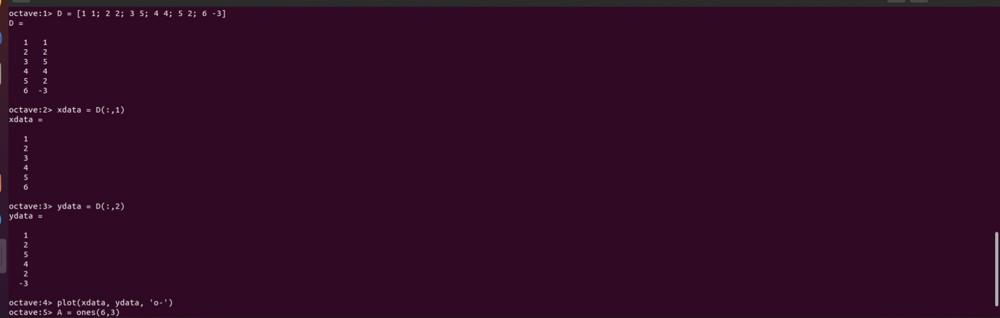{ #fig:002 width=70% }

Построим уравнение вида $y = ax^2 + bx + c$ (рис. [-@fig:003])

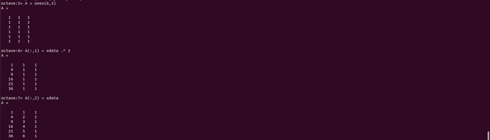{ #fig:003 width=70% }

Решение по методу наименьших квадратов получается из решения уравнения $A^TAb = A^Ty$, где $b$ – вектор коэффициентов полинома. Решим его с помощью Octave. Построим график полученной параболы
(рис. [-@fig:004], [-@fig:005])

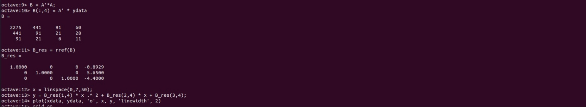{ #fig:004 width=70% }
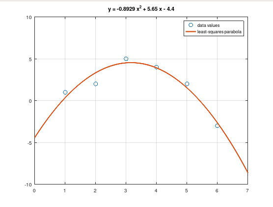{ #fig:005 width=70% }

Для подгонки можно использовать встроенную функцию `polyfit`. Значения полинома $P$ в точках, задаваемых вектором-строкой x можно получить с помощью функции `polyval` (рис. [-@fig:006])

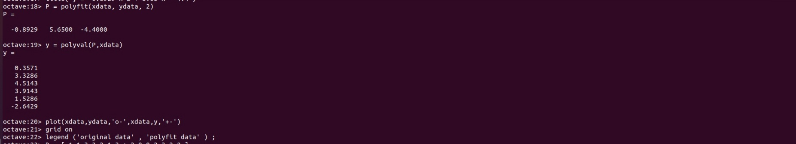{ #fig:006 width=70% }

Закодируем граф-домик. Выберем путь, который проходит по каждому ребру ровно один раз. Повернем граф на 90 и 225 градусов с помощью матрицы поворота (рис. [-@fig:007], [-@fig:008])

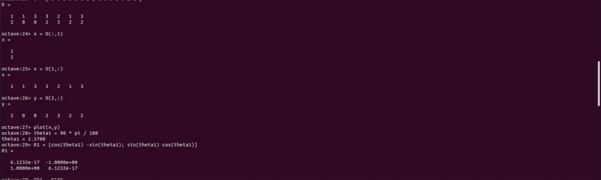{ #fig:007 width=70% }
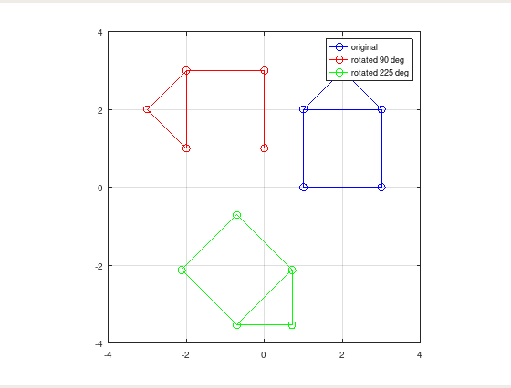{ #fig:008 width=70% }

Отразим граф дома относительно прямой $y = x$. Зададим матрицу отражения, подставив угол 45 градусов, так как именно под таким углом относительно оси абсцисс проходит прямая $y = x$. (рис. [-@fig:009],[-@fig:010])

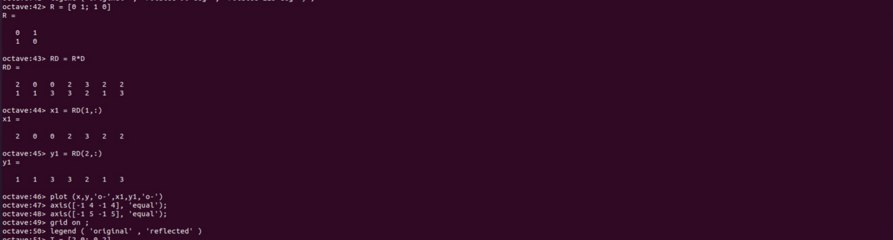{ #fig:009 width=70% }
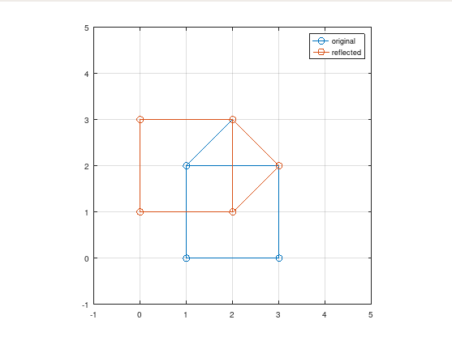{ #fig:010 width=70% }

Увеличим граф дома в 2 раза, используя матрицу для делитации (рис. [-@fig:011],[-@fig:012])

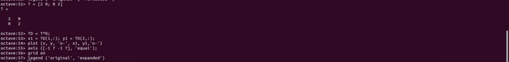{ #fig:011 width=70% }
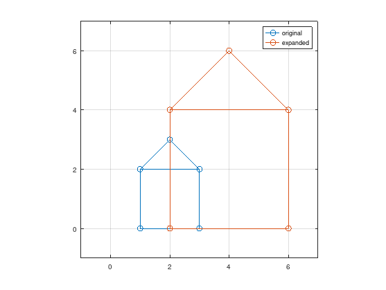{ #fig:012 width=70% }

# Выводы

В результате выполнения работы научились подгонять полиномы и выполнять афинные преобразования графиком с помощью системы для математических вычислений Oсtave.

# Список литературы{.unnumbered}

::: {#refs}
:::
