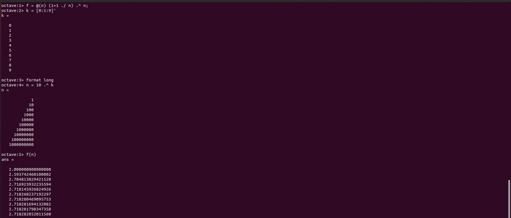
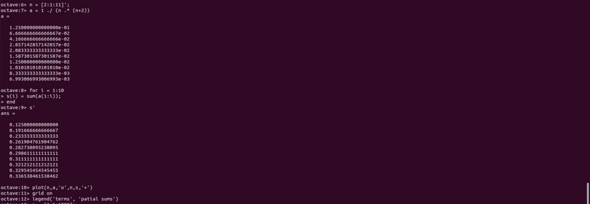
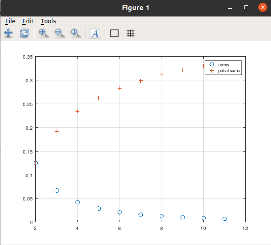
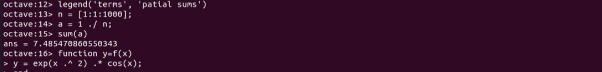
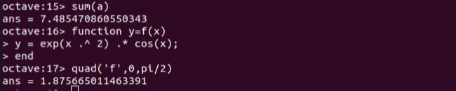
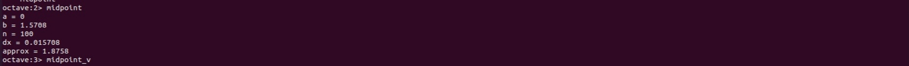
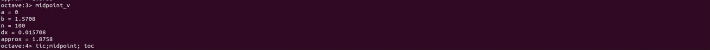
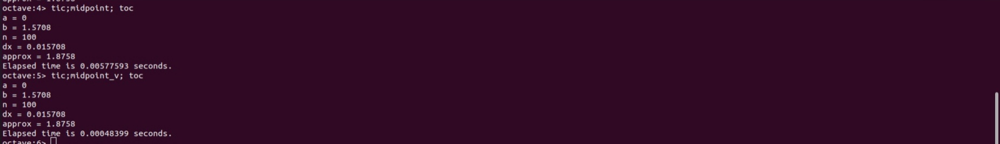

---
## Front matter
lang: ru-RU
title: Лабораторная работа №6
subtitle: Пределы, последовательности, ряды и интегрирование
author:
  - Смирнов-Мальцев Е. Д.
institute:
  - Российский университет дружбы народов им. Патриса Лумумбу, Москва, Россия
date: 26 мая 2023

## i18n babel
babel-lang: russian
babel-otherlangs: english

## Formatting pdf
toc: false
toc-title: Содержание
slide_level: 2
aspectratio: 169
section-titles: true
theme: metropolis
header-includes:
 - \metroset{progressbar=frametitle,sectionpage=progressbar,numbering=fraction}
 - '\makeatletter'
 - '\beamer@ignorenonframefalse'
 - '\makeatother'

style: |
  section h2 {
    text-align: center;
  }

---

# Информация

## Докладчик

  * Смирнов-Мальцев Егор Дмитриевич
  * студент группы НКНбд-01-21
  * Российский университет дружбы народов им. Патриса Лумумбу

---

# Цель работы

1. Научиться считать пределы,
2. Научиться работать с последовательностями и рядами,
3. Научиться выполнять численное интегрирование.

---

# Задание

- Оценить предел,
- Найти частичные суммы,
- Найти сумму ряда,
- Вычислить интеграл встроенной функцией,
- Вычислить интеграл по правилу средней точки.

---

# Выполнение лабораторной работы

Оценим предел:
$$
\lim_{n\to\infty}(1+\frac{1}{n})^n.
$$
Для этого определим функцию `f` равную этому выражению. Затем создадим вектор из степеней 10. Оценим `f(n)`.

## 

---

# Выполнение лабораторной работы

Найдем частичные суммы ряда $\sum_{n=2}^{\infty} \frac{1}{n(n+2)}.$ Для получения последовательности частичных сумм используем цикл и функцию `sum()`. Затем отобразим слагаемые и частичные суммы на графике.

##  

---

# Выполнение лабораторной работы

Найдём сумму первых 1000 членов ряда

$$
\sum_{n=1}^{1000} \frac{1}{n}.
$$

Для этого сгенерируем члены ряда как вектор и возьмём их сумму.

## 

---

# Выполнение лабораторной работы

Вычислим интеграл

$$
\int_{0}^{\pi/2} e^{x^2}cos(x)dx,
$$

с помощью встроенной функции `quad('f',a,b)`.

## 

---

# Выполнение лабораторной работы

Напишем функцию, вычисляющую интеграл по правилу средней точки через цикл. Она расположена в файле `programs/midpoint.m`. Применим ее.

## 

---

# Выполнение лабораторной работы

Напишем такую же функцию через векторы. Новая функция расположена в файле `programs/midpoint_v.m`. Применим ее.

## 

---

# Выполнение лабораторной работы

Сравним время выполнения для каждой функции.

## 

---

# Выводы

В результате выполнения работы научились работать с пределами, последовательностями, рядами и выполнять численное интегрирование в Octave.

---

# Список литературы

1. Подгонка кривой [Электронный ресурс]. Wikimedia Foundation, Inc., 2023.
URL: https://wikipredia.net/ru/Model_fitting#cite_note-3.
2. Умнов А.Е. АНАЛИТИЧЕСКАЯ ГЕОМЕТРИЯ И ЛИНЕЙНАЯ АЛГЕБРА. МФТИ, 2011. 544 с
