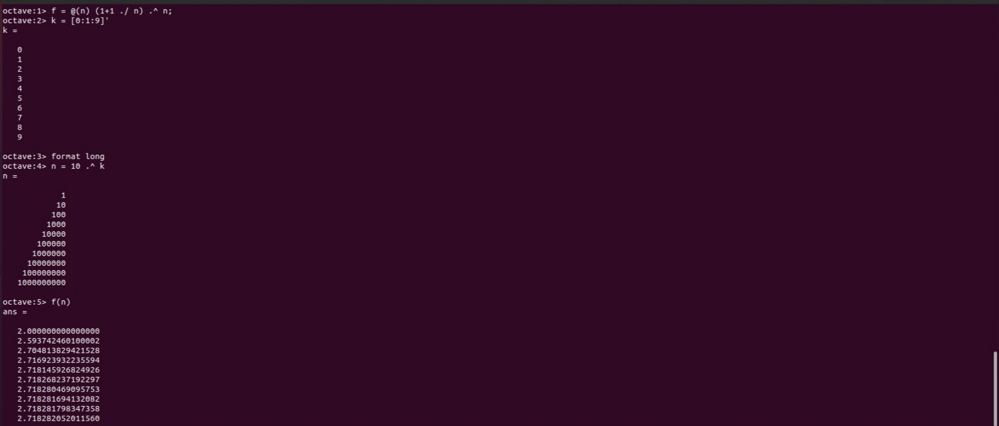
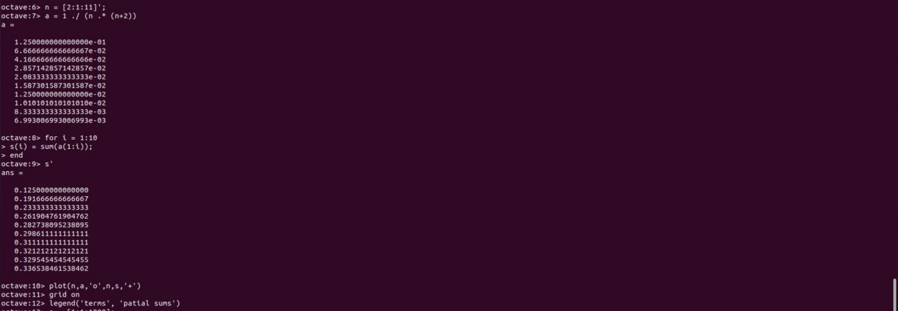
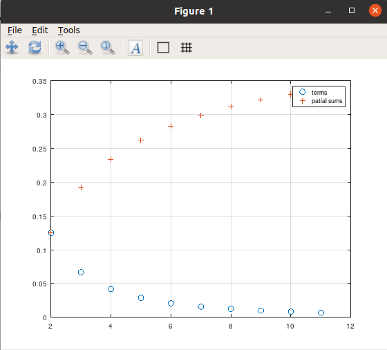
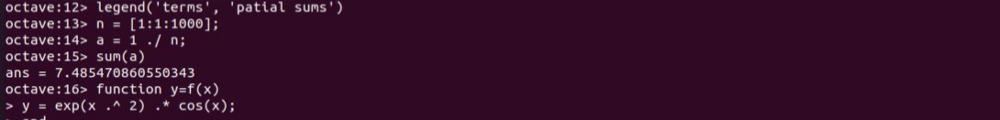
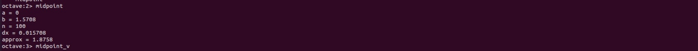
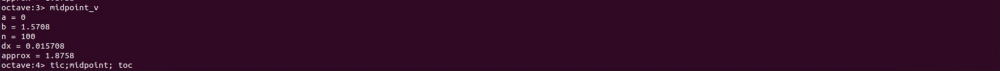
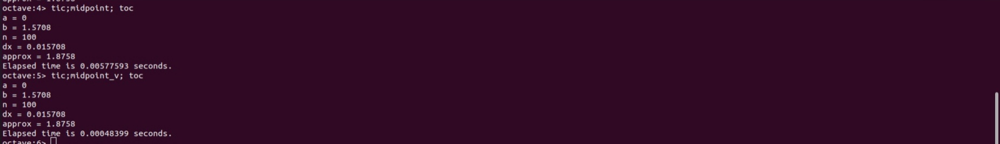

---
## Front matter
title: "Лабораторная работа №6"
subtitle: "Пределы, последовательности, ряды и интегрирование"
author: "Смирнов-Мальцев Егор Дмитриевич"

## Generic otions
lang: ru-RU
toc-title: "Содержание"

## Bibliography
bibliography: bib/cite.bib
csl: pandoc/csl/gost-r-7-0-5-2008-numeric.csl

## Pdf output format
toc: true # Table of contents
toc-depth: 2
lof: true # List of figures
lot: false # List of tables
fontsize: 12pt
linestretch: 1.5
papersize: a4
documentclass: scrreprt
## I18n polyglossia
polyglossia-lang:
  name: russian
  options:
	- spelling=modern
	- babelshorthands=true
polyglossia-otherlangs:
  name: english
## I18n babel
babel-lang: russian
babel-otherlangs: english
## Fonts
mainfont: PT Serif
romanfont: PT Serif
sansfont: PT Sans
monofont: PT Mono
mainfontoptions: Ligatures=TeX
romanfontoptions: Ligatures=TeX
sansfontoptions: Ligatures=TeX,Scale=MatchLowercase
monofontoptions: Scale=MatchLowercase,Scale=0.9
## Biblatex
biblatex: true
biblio-style: "gost-numeric"
biblatexoptions:
  - parentracker=true
  - backend=biber
  - hyperref=auto
  - language=auto
  - autolang=other*
  - citestyle=gost-numeric
## Pandoc-crossref LaTeX customization
figureTitle: "Рис."
tableTitle: "Таблица"
listingTitle: "Листинг"
lofTitle: "Список иллюстраций"
lotTitle: "Список таблиц"
lolTitle: "Листинги"
## Misc options
indent: true
header-includes:
  - \usepackage{indentfirst}
  - \usepackage{float} # keep figures where there are in the text
  - \floatplacement{figure}{H} # keep figures where there are in the text
---

# Цель работы

1. Научиться считать пределы,
2. Научиться работать с последовательностями и рядами,
3. Научиться выполнять численное интегрирование.

# Задание

- Оценить предел,
- Найти частичные суммы,
- Найти сумму ряда,
- Вычислить интеграл встроенной функцией,
- Вычислить интеграл по правилу средней точки.

# Теоретическое введение

Интеграл примерно равен сумме по разбиению значений умноженных на длину интервала. Octave - векторно-ориентированный язык. Поэтому стоит использовать вектора вместо циклов при выполнении заданий.

# Выполнение лабораторной работы

Оценим предел:
$$
\lim_{n\to\infty}(1+\frac{1}{n})^n.
$$
Для этого определим функцию `f` равную этому выражению. Затем создадим вектор из степеней 10. Оценим `f(n)`.
(рис. [-@fig:001])

{ #fig:001 width=70% }

Найдем частичные суммы ряда

$$
\sum_{n=2}^{\infty} \frac{1}{n(n+2)}.
$$

Для получения последовательности частичных сумм используем цикл и цункцию `sum()`. Затем отобразим слагаемые и частичные суммы на графике (рис. [-@fig:002], [-@fig:003]).

{ #fig:002 width=70% }

{ #fig:003 width=70% }

Найдём сумму первых 1000 членов ряда

$$
\sum_{n=1}^{1000} \frac{1}{n}.
$$

Для этого сгенерируем члены ряда как вектор и возьмём их сумму (рис. [-@fig:004]).

{ #fig:004 width=70% }

Вычислим интеграл

$$
\int_{0}^{\pi/2} e^{x^2}cos(x)dx,
$$

с помощью встроенной функции `quad('f',a,b)` (рис. [-@fig:005])

{ #fig:005 width=70% }

Напишем функцию, вычисляющую интеграл по правилу средней точки через цикл. Она расположена в файле `programs/midpoint.m`. Применим ее (рис. [-@fig:006])

{ #fig:006 width=70% }

Напишем такую же функцию через векторы. Новая функция расположена в файле `programs/midpoint_v.m`. Применим ее (рис. [-@fig:007]).

{ #fig:007 width=70% }

Сравним время выполнения для каждой функции (рис. [-@fig:008]).

{ #fig:008 width=70% }

# Выводы

В результате выполнения работы научились работать с пределами, последовательностями, рядами и выполнять численное интегрирование в Octave.

# Список литературы{.unnumbered}

::: {#refs}
:::
