---
## Front matter
lang: ru-RU
title: Лабораторная работа №7
subtitle: Построение графиков
author:
  - Смирнов-Мальцев Е. Д.
institute:
  - Российский университет дружбы народов им. Патриса Лумумбу, Москва, Россия
date: 26 мая 2023

## i18n babel
babel-lang: russian
babel-otherlangs: english

## Formatting pdf
toc: false
toc-title: Содержание
slide_level: 2
aspectratio: 169
section-titles: true
theme: metropolis
header-includes:
 - \metroset{progressbar=frametitle,sectionpage=progressbar,numbering=fraction}
 - '\makeatletter'
 - '\beamer@ignorenonframefalse'
 - '\makeatother'

style: |
  section h2 {
    text-align: center;
  }

---

# Лабораторная работа №7

## Построение графиков в Octave

---

# Информация

## Докладчик

  * Смирнов-Мальцев Егор Дмитриевич
  * студент группы НКНбд-01-21
  * Российский университет дружбы народов им. Патриса Лумумбу

---

# Цель работы

Научиться строить графики в Octave.

---

# Задание

- Построить параметрический графики
- Построить график в полярных координатах
- Построить график неявной функции
- Построить график в комплексной области
- Построить график встроенной функции

---

# Выполнение лабораторной работы

Построим три периода циклоиды радиуса 2. Поскольку период $2\pi$, зададим параметр на отрезке $[0,6\pi]$ для трёх полных циклов. Определим  $t$ как вектор в этом диапазоне, затем вычислим $x$ и $y$.

## 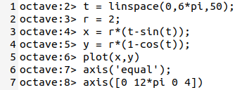 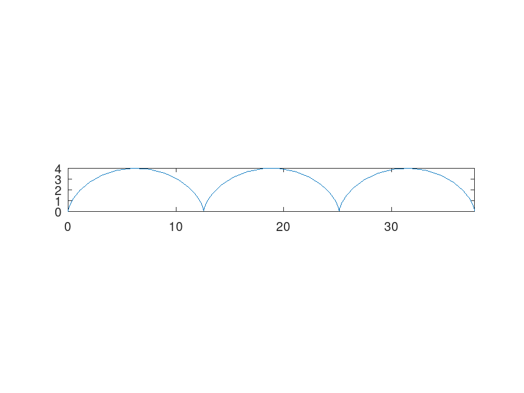

---

# Выполнение лабораторной работы

Построим улитку Паскаля. Для этого определим независимую переменную $\theta$, отвечающую за угол в полярных координатах. Затем вычислим расстояние $r$ до начала координат. Построим график, используя стандартное преобразование координат.

## 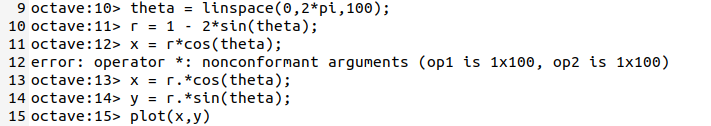 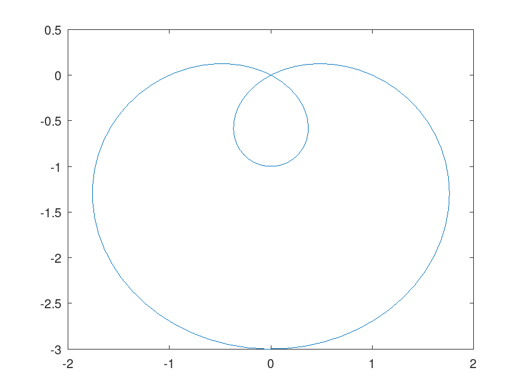

---

# Выполнение лабораторной работы

Построим этот же график в полярных координатах, с помощью встроенной функции `polar`.

## 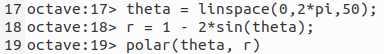 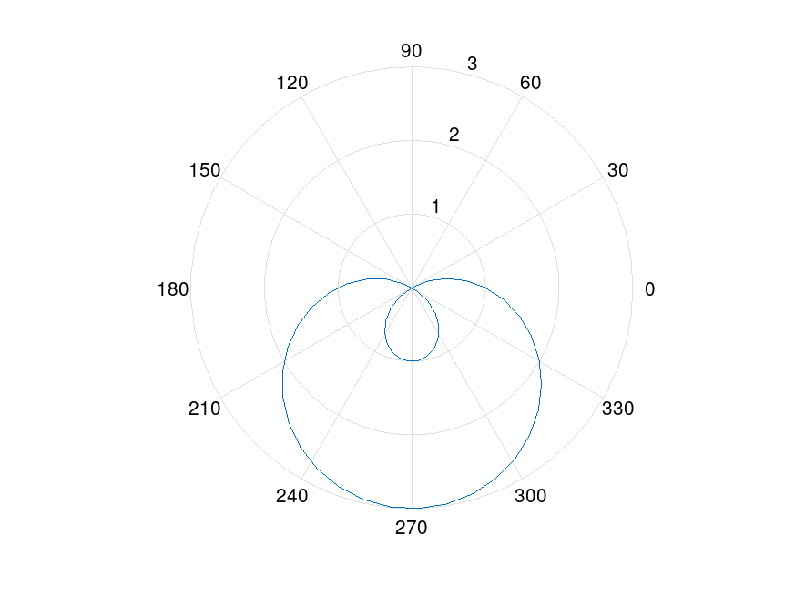

---

# Выполнение лабораторной работы

Построим график кривой, заданной уравнением:
$$
-x^2-xy+x+y^2-y=1
$$
Для этого используем функцию `ezplot` .

## 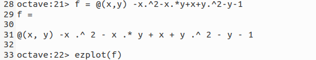 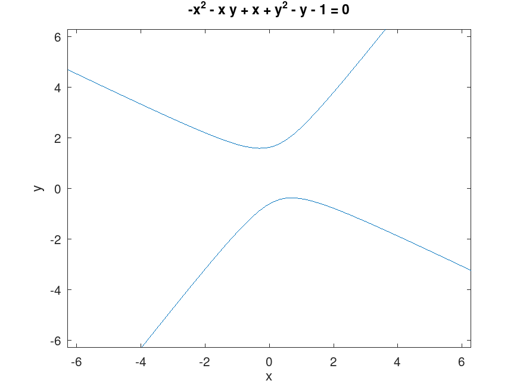

---

# Выполнение лабораторной работы

Построим окружность $(x-2)^2 + y^2 = 25$. Найдем касательную к ней в точке $(-1,4)$. Для этого продиффиринцируем функцию в данной точке. Производная равна $\dfrac{3}{4}$. Поэтому уравнение касательной имеет вид:
$$
y = \frac{3}{4}x+\frac{19}{4}
$$
Построим ее график.

## 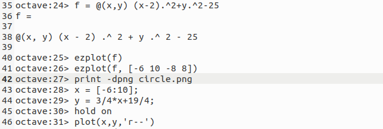 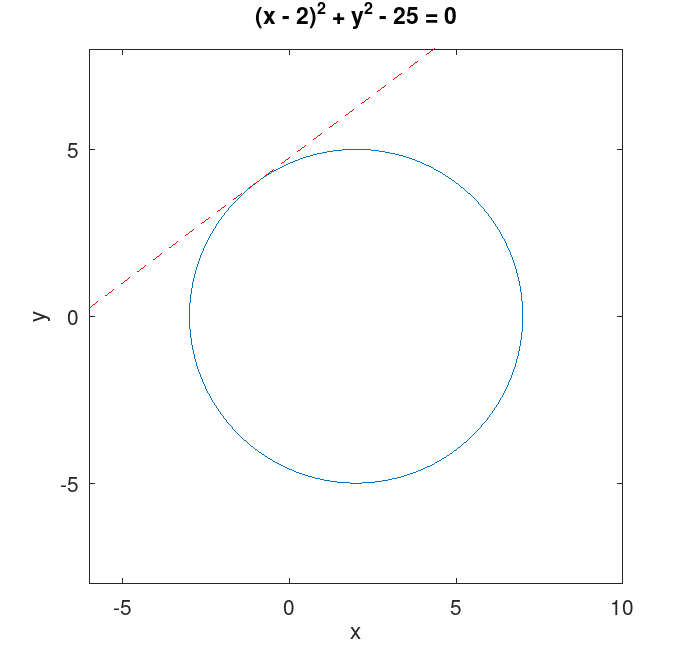

---

# Выполнение лабораторной работы

Зададим комплексные числа и выполним основные арифметические операции над ними.

## 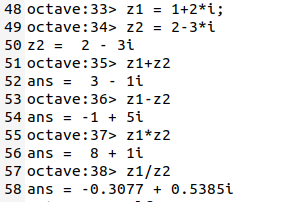

---

# Выполнение лабораторной работы

Построим график в комплексной плоскости, используя команду `compass`.

## 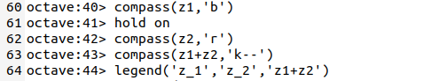 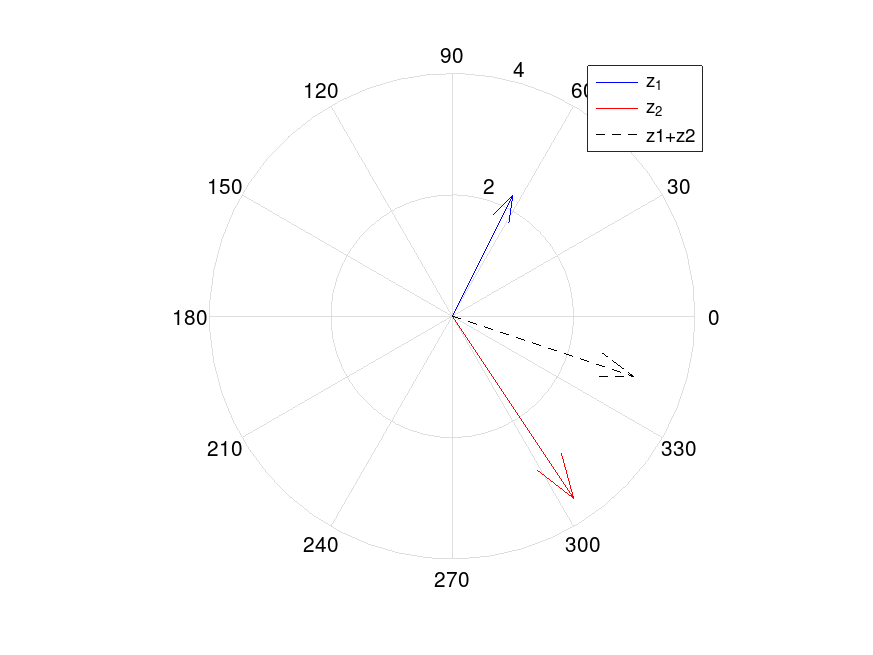

---

# Выполнение лабораторной работы

Вычислим $\sqrt[3]{-8}$. Делая это возведением в степень $1/3$, получим комплексный корень. Для получения вещественного корня необходимо использовать функцию `nthroot`.

## 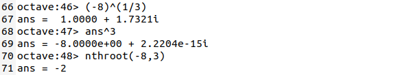

---

# Выполнение лабораторной работы

Построим функции $\Gamma(x+1)$ и $n!$ на одном графике.

## 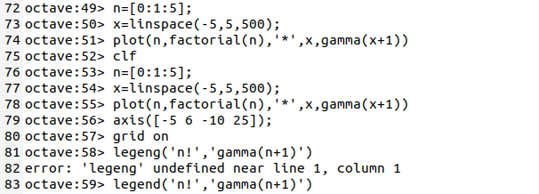 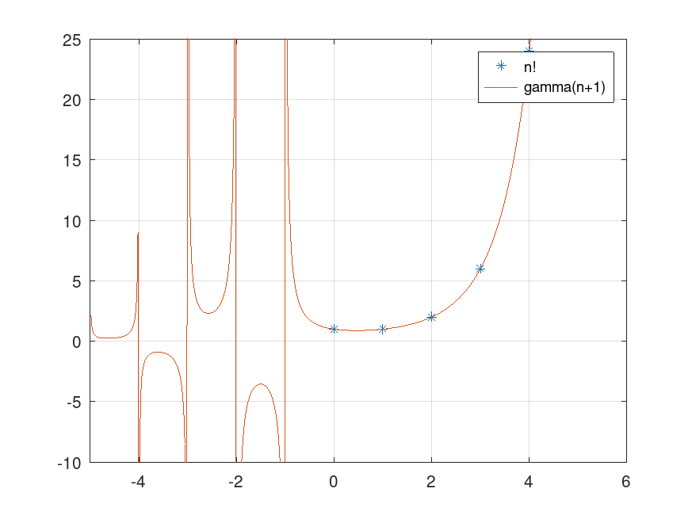

---

# Выполнение лабораторной работы

Вертикальные асимптоты в районе отрицательных чисел на графике являются артефактами вычисления. Уберём их, разделив область значений.

## 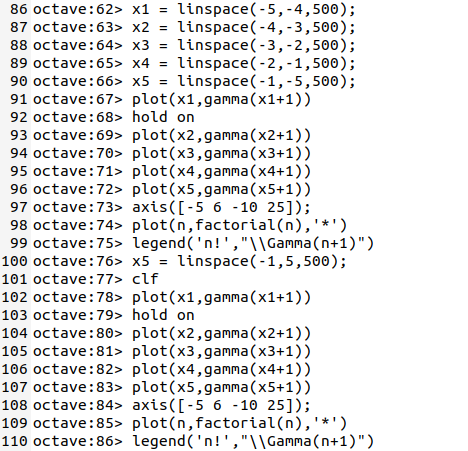 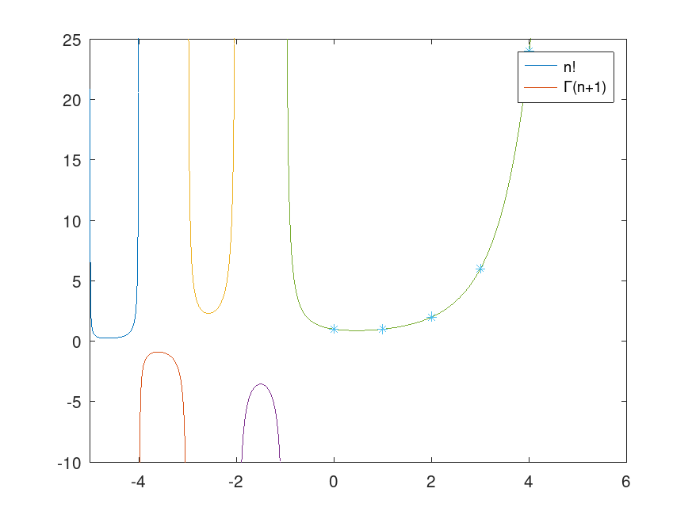

---

# Выводы

В результате выполнения работы мы научились строить двумерные графики в декартовых и полярных координатах в Octave.

---

# Список литературы

1. Подгонка кривой [Электронный ресурс]. Wikimedia Foundation, Inc., 2023.
URL: https://wikipredia.net/ru/Model_fitting#cite_note-3.
2. Умнов А.Е. АНАЛИТИЧЕСКАЯ ГЕОМЕТРИЯ И ЛИНЕЙНАЯ АЛГЕБРА. МФТИ, 2011. 544 с
