---
## Front matter
title: "Лабораторная работа №7"
subtitle: "Графики в Octave"
author: "Смирнов-Мальцев Егор Дмитриевич"

## Generic otions
lang: ru-RU
toc-title: "Содержание"

## Bibliography
bibliography: bib/cite.bib
csl: pandoc/csl/gost-r-7-0-5-2008-numeric.csl

## Pdf output format
toc: true # Table of contents
toc-depth: 2
lof: true # List of figures
lot: false # List of tables
fontsize: 12pt
linestretch: 1.5
papersize: a4
documentclass: scrreprt
## I18n polyglossia
polyglossia-lang:
  name: russian
  options:
	- spelling=modern
	- babelshorthands=true
polyglossia-otherlangs:
  name: english
## I18n babel
babel-lang: russian
babel-otherlangs: english
## Fonts
mainfont: PT Serif
romanfont: PT Serif
sansfont: PT Sans
monofont: PT Mono
mainfontoptions: Ligatures=TeX
romanfontoptions: Ligatures=TeX
sansfontoptions: Ligatures=TeX,Scale=MatchLowercase
monofontoptions: Scale=MatchLowercase,Scale=0.9
## Biblatex
biblatex: true
biblio-style: "gost-numeric"
biblatexoptions:
  - parentracker=true
  - backend=biber
  - hyperref=auto
  - language=auto
  - autolang=other*
  - citestyle=gost-numeric
## Pandoc-crossref LaTeX customization
figureTitle: "Рис."
tableTitle: "Таблица"
listingTitle: "Листинг"
lofTitle: "Список иллюстраций"
lotTitle: "Список таблиц"
lolTitle: "Листинги"
## Misc options
indent: true
header-includes:
  - \usepackage{indentfirst}
  - \usepackage{float} # keep figures where there are in the text
  - \floatplacement{figure}{H} # keep figures where there are in the text
---

# Цель работы

Научиться строить графики в Octave.

# Задание

- Построить параметрический графики
- Построить график в полярных координатах
- Построить график неявной функции
- Построить график в комплексной области
- Построить график встроенной функции

# Теоретическое введение

Декартова или прямоугольная система координат, задается двумя перпендикулярными
прямыми, называемыми осями координат.

Функция считается заданной, если для каждого
значения аргумента существует соответствующее значение функции. Чаще всего используют
следующие способы задания функций:
• табличный – числовые значения функции уже заданы и занесены в таблицу,
недостаток заключается в том, что таблица может не содержать все нужные значения
функции;
• графический – значения функции заданы при помощи линии (графика), у которой
абсциссы изображают значения аргумента, а ординаты – соответствующие значения
функции;
• аналитический – функция задается одной или несколькими формулами
(уравнениями), при этом, если зависимость между х и у выражена уравнением,
разрешенным относительно у, то говорят о явно заданной функции, в противном случае
функция считается неявной.

Совокупность всех значений, которые может принимать в условиях поставленной
задачи аргумент х функции y=f(x), называется областью определения этой функции.
Совокупность значений y, которые принимает функция f(x), называется множеством
значений функции.

# Выполнение лабораторной работы

## Графики параметрически заданных функций

Построим три периода циклоиды радиуса 2. Поскольку период $2\pi$, зададим параметр на отрезке $[0,6\pi]$ для трёх полных циклов. Определим  $t$ как вектор в этом диапазоне, затем вычислим $x$ и $y$(рис. [-@fig:001],[-@fig:002]).

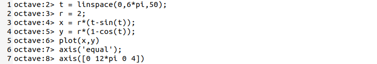{ #fig:001 width=70% }

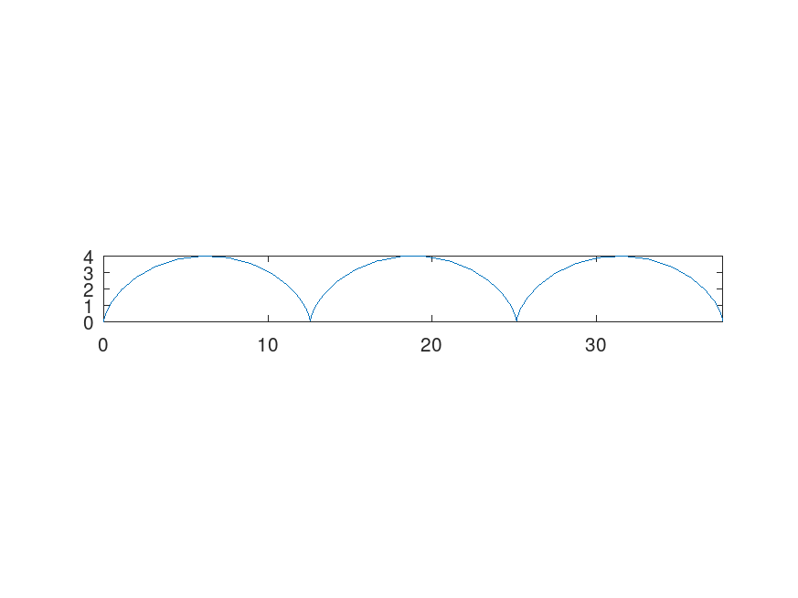{ #fig:002 width=70% }

## Графики в полярных координатах

Построим улитку Паскаля. Для этого определим независимую переменную $\theta$, отвечающую за угол в полярных координатах. Затем вычислим расстояние $r$ до начала координат. Построим график, используя стандартное преобразование координат(рис. [-@fig:003],[-@fig:004]).

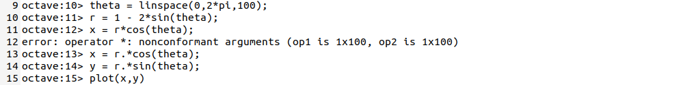{ #fig:003 width=70% }

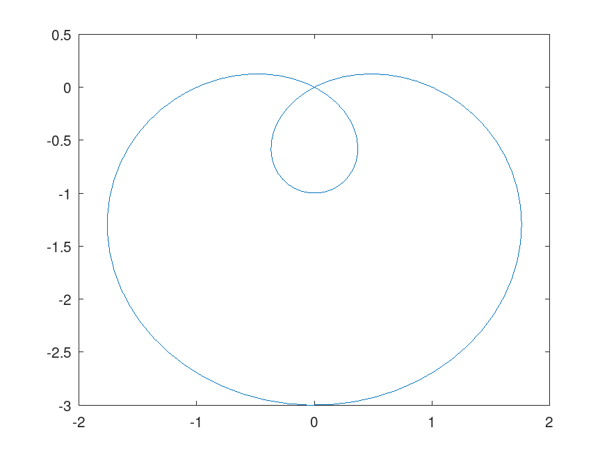{ #fig:004 width=70% }

Построим этот же график в полярных координатах, с помощью встроенной функции `polar`(рис. [-@fig:005],[-@fig:006]).

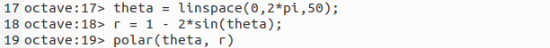{ #fig:005 width=70% }

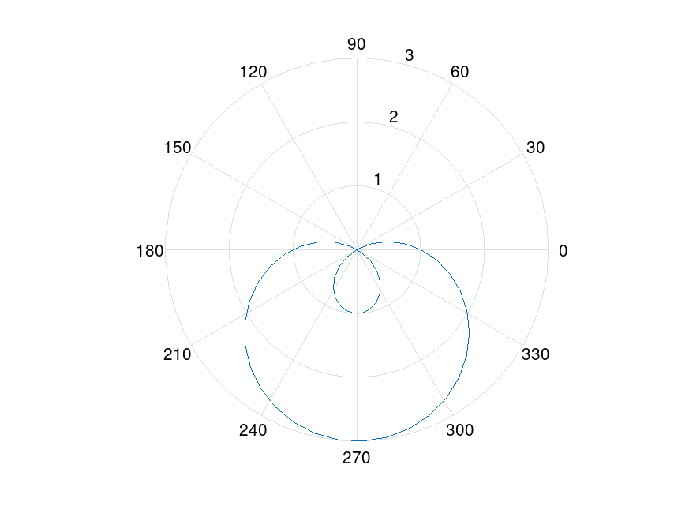{ #fig:006 width=70% }

## Графики неявных функций

Построим график кривой, заданной уравнением:
$$
-x^2-xy+x+y^2-y=1
$$
Для этого используем функцию `ezplot` (рис. [-@fig:007],[-@fig:008]).

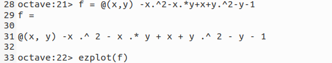{ #fig:007 width=70% }

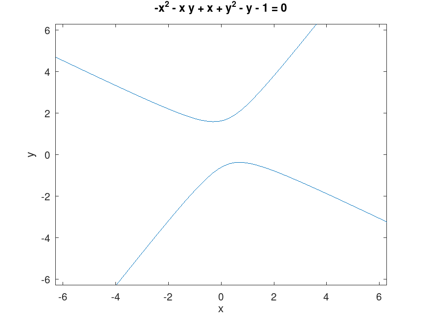{ #fig:008 width=70% }

Построим окружность $(x-2)^2 + y^2 = 25$. Найдем касательную к ней в точке $(-1,4)$. Для этого продиффиринцируем функцию в данной точке. Производная равна $\dfrac{3}{4}$. Поэтому уравнение касательной имеет вид:
$$
y = \frac{3}{4}x+\frac{19}{4}
$$
Построим ее график (рис. [-@fig:009],[-@fig:010]).

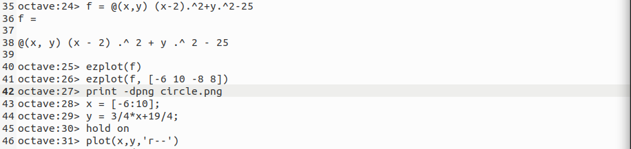{ #fig:005 width=70% }

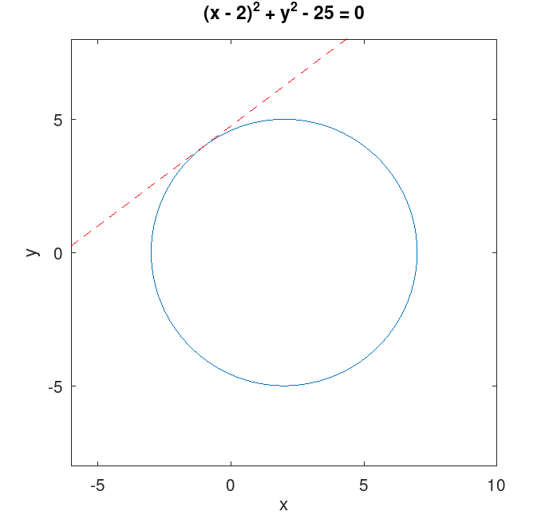{ #fig:005 width=70% }

## Комплексная плоскость

Зададим комплексные числа и выполним основные арифметические операции над ними (рис. [-@fig:011]).

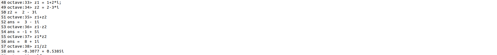{ #fig:006 width=70% }

Построим график в комплексной плоскости, используя команду `compass`(рис.[-@fig:012],[-@fig:013]).

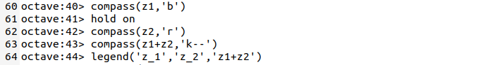{ #fig:012 width=70% }

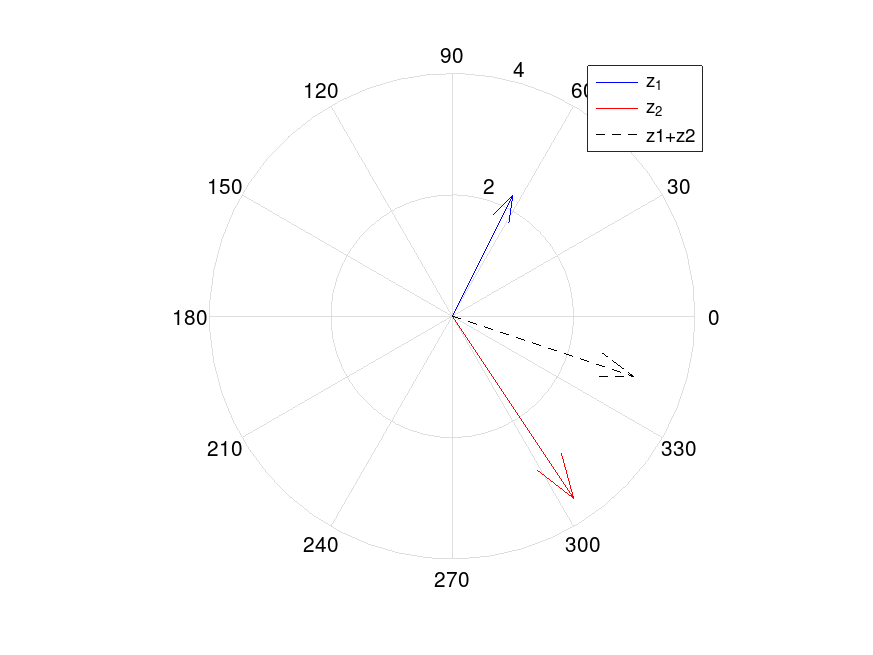{ #fig:013 width=70% }

Вычислим $\sqrt[3]{-8}$. Делая это возведением в степень $1/3$, получим комплексный корень. Для получения вещественного корня необходимо использовать функцию `nthroot`(рис. [-@fig:014]).

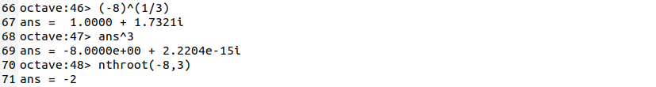{ #fig:014 width=70% }

## Построение графиков встроенных функций

Построим функции $\Gamma(x+1)$ и $n!$ на одном графике(рис. [-@fig:015],[-@fig:016]).

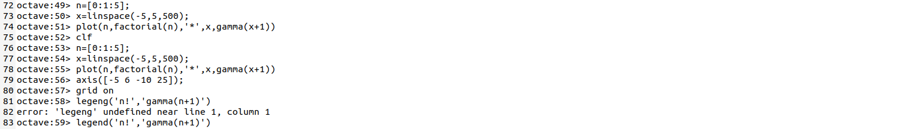{ #fig:015 width=70% }

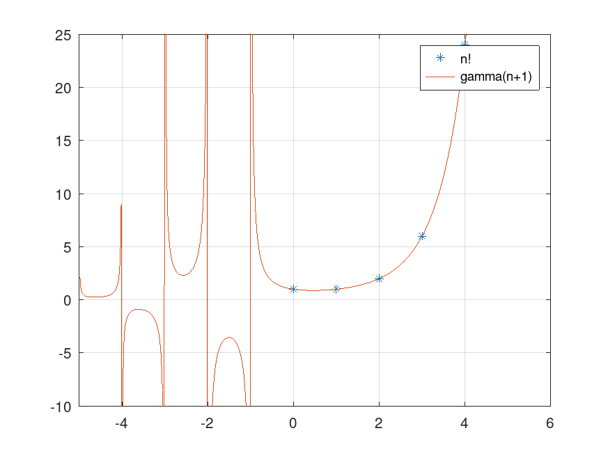{ #fig:016 width=70% }

Вертикальные асимптоты в районе отрицательных чисел на графике являются артефактами вычисления. Уберём их, разделив область значений(рис. [-@fig:017],[-@fig:018]).

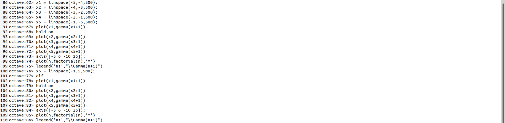{ #fig:017 width=70% }

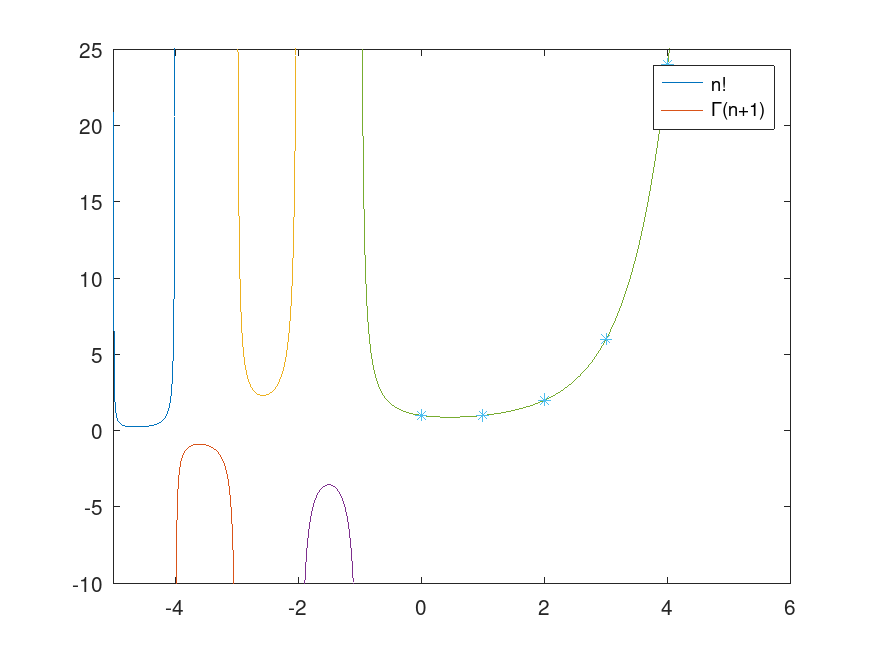{ #fig:018 width=70% }

# Выводы

В результате выполнения работы мы научились строить двумерные графики в декартовых и полярных координатах в Octave.

# Список литературы{.unnumbered}

::: {#refs}
:::
