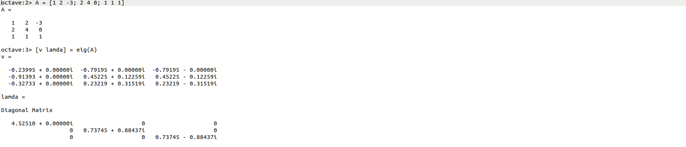
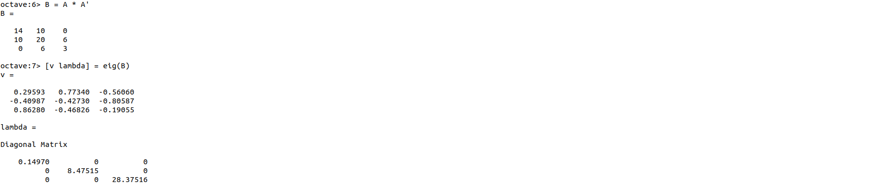
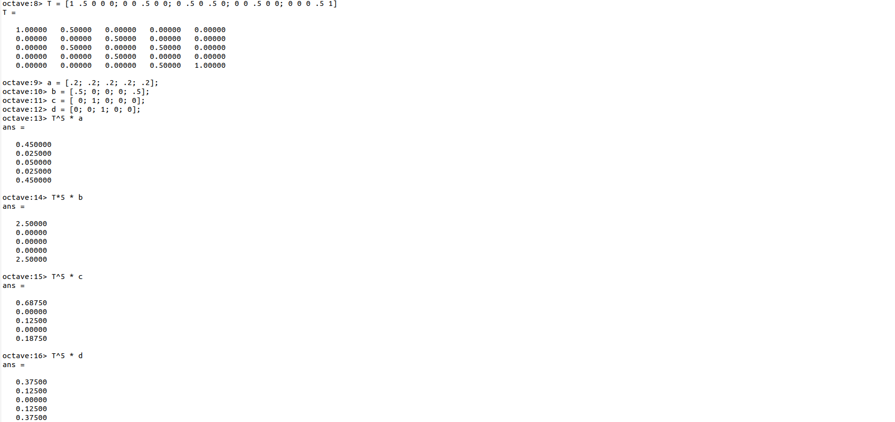
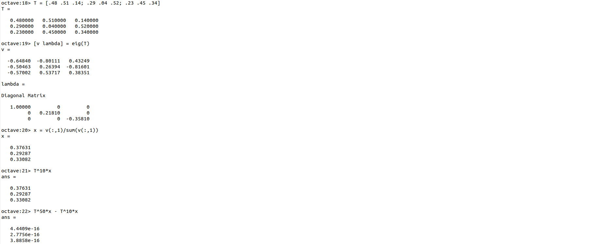

---
## Front matter
lang: ru-RU
title: Лабораторная работа №8
subtitle: Cобственные значения матриц
author:
  - Смирнов-Мальцев Е. Д.
institute:
  - Российский университет дружбы народов им. Патриса Лумумбу, Москва, Россия
date: 10 июня 2023

## i18n babel
babel-lang: russian
babel-otherlangs: english

## Formatting pdf
toc: false
toc-title: Содержание
slide_level: 2
aspectratio: 169
section-titles: true
theme: metropolis
header-includes:
 - \metroset{progressbar=frametitle,sectionpage=progressbar,numbering=fraction}
 - '\makeatletter'
 - '\beamer@ignorenonframefalse'
 - '\makeatother'


style: |
  section h2 {
    text-align: center;
  }

---

# Лабораторная работа №7

## Cобственные значения матриц

---

# Информация

## Докладчик

  * Смирнов-Мальцев Егор Дмитриевич
  * студент группы НКНбд-01-21
  * Российский университет дружбы народов им. Патриса Лумумбу

---

# Цель работы

Решить задачи, связанные с собственными значениями матриц.

---

# Задание

- Найти собственные значения и собственные векторы матрицы
- Решить задачу о случайном блуждании
- Найти равновесное состояние цепи Маркова

---

# Выполнение лабораторной работы

Зададим матрицу $A$ и найдём ее собственные значения и векторы командой ```eig```.

## 

---

# Выполнение лабораторной работы

Умноженим $A$ на свою транспонированную матрицу, чтобы получить матрицу с вещественными собственными значениями.

## 

---

# Выполнение лабораторной работы

Решим задачу случайного блуждания. Зададим начальные векторы вероятности, сформируем матрицу переходов и найдём вектор вероятности после 5 шагов.

## 

---

# Выполнение лабораторной работы

Найдём равновесное состояние. Для этого найдем собственные векторы матрицы перехода. Вектор равновесного состояния можно найти, разделив собственный вектор на сумму элементов этого вектора.

## 

---

# Выводы

1. Найти собственные значения и вектора матрицы можно с помощью функции ```eig```.
2. Найти равновесное состояние Марковских цепей можно с помощью собственных векторов матрицы перехода.

---

# Список литературы

1. Умнов А.Е. АНАЛИТИЧЕСКАЯ ГЕОМЕТРИЯ И ЛИНЕЙНАЯ АЛГЕБРА. МФТИ, 2011. 544 с
