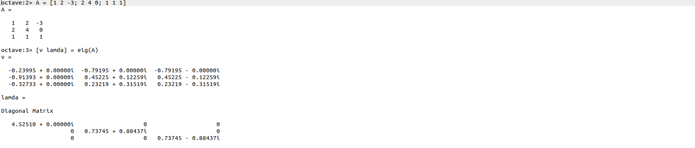
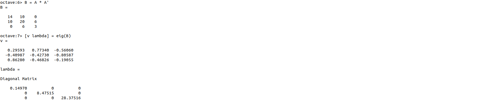
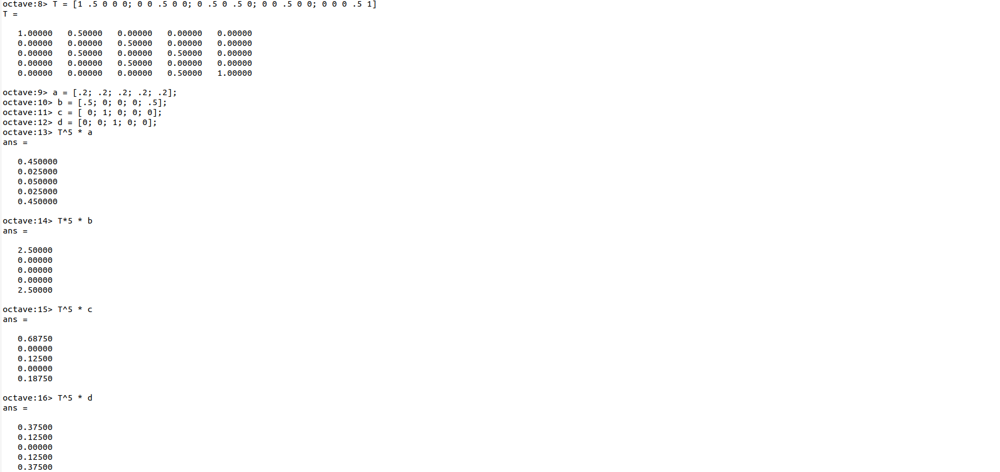
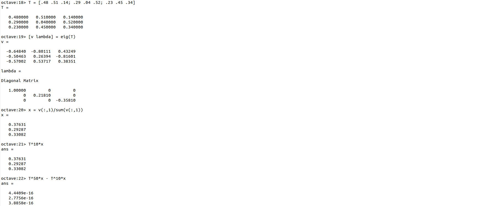

---
## Front matter
title: "Лабораторная работа №8"
subtitle: "Cобственные значения матриц"
author: "Смирнов-Мальцев Егор Дмитриевич"

## Generic otions
lang: ru-RU
toc-title: "Содержание"

## Bibliography
bibliography: bib/cite.bib
csl: pandoc/csl/gost-r-7-0-5-2008-numeric.csl

## Pdf output format
toc: true # Table of contents
toc-depth: 2
lof: true # List of figures
lot: false # List of tables
fontsize: 12pt
linestretch: 1.5
papersize: a4
documentclass: scrreprt
## I18n polyglossia
polyglossia-lang:
  name: russian
  options:
	- spelling=modern
	- babelshorthands=true
polyglossia-otherlangs:
  name: english
## I18n babel
babel-lang: russian
babel-otherlangs: english
## Fonts
mainfont: PT Serif
romanfont: PT Serif
sansfont: PT Sans
monofont: PT Mono
mainfontoptions: Ligatures=TeX
romanfontoptions: Ligatures=TeX
sansfontoptions: Ligatures=TeX,Scale=MatchLowercase
monofontoptions: Scale=MatchLowercase,Scale=0.9
## Biblatex
biblatex: true
biblio-style: "gost-numeric"
biblatexoptions:
  - parentracker=true
  - backend=biber
  - hyperref=auto
  - language=auto
  - autolang=other*
  - citestyle=gost-numeric
## Pandoc-crossref LaTeX customization
figureTitle: "Рис."
tableTitle: "Таблица"
listingTitle: "Листинг"
lofTitle: "Список иллюстраций"
lotTitle: "Список таблиц"
lolTitle: "Листинги"
## Misc options
indent: true
header-includes:
  - \usepackage{indentfirst}
  - \usepackage{float} # keep figures where there are in the text
  - \floatplacement{figure}{H} # keep figures where there are in the text
---

# Цель работы

Решить задачи, связанные с собственными значениями матриц.

# Задание

- Найти собственные значения и собственные векторы матрицы
- Решить задачу о случайном блуждании
- Найти равновесное состояние цепи Маркова

# Теоретическое введение

Случайное блуждание — математический объект, известный как стохастический или случайный процесс, который описывает путь, состоящий из последовательности случайных шагов в каком-нибудь математическом пространстве (например, на множестве целых чисел).

Простейшим примером случайного блуждания является случайное блуждание по числовой прямой целых чисел, $\mathbb {Z}$, которое начинается в точке 0 и на каждом шаге сдвигается на +1 или на −1 с равной вероятностью. Другими примерами могут послужить траектория движения молекулы в жидкости или газе (броуновское движение), поиск пути у животных во время фуражировки, колебания цен акций на фондовом рынке, финансовое состояние игрока: все описанные случаи могут быть аппроксимированы моделями случайного блуждания, даже несмотря на то, что они могут не быть полностью случайными в реальной жизни.

# Выполнение лабораторной работы

## Нахождение собственных значений и векторов

Зададим матрицу $A$ и найдём ее собственные значения и векторы командой ```eig``` (рис. [-@fig:001]).

{ #fig:001 width=70% }

Умноженим $A$ на свою транспонированную матрицу, чтобы получить матрицу с вещественными собственными значениями (рис. [-@fig:002]).

{ #fig:002 width=70% }

## Марковские цепи

Решим задачу случайного блуждания. Зададим начальные векторы вероятности, сформируем матрицу переходов и найдём вектор вероятности после 5 шагов. (рис. [-@fig:003]).

{ #fig:003 width=70% }

Найдём равновесное состояние. Для этого найдем собственные векторы матрицы перехода. Вектор равновесного состояния можно найти, разделив собственный вектор на сумму элементов этого вектора (рис. [-@fig:004]).

{ #fig:004 width=70% }

# Выводы

1. Найти собственные значения и вектора матрицы можно с помощью функции ```eig```.
2. Найти равновесное состояние Марковских цепей можно с помощью собственных векторов матрицы перехода.

# Список литературы{.unnumbered}

::: {#refs}
:::
