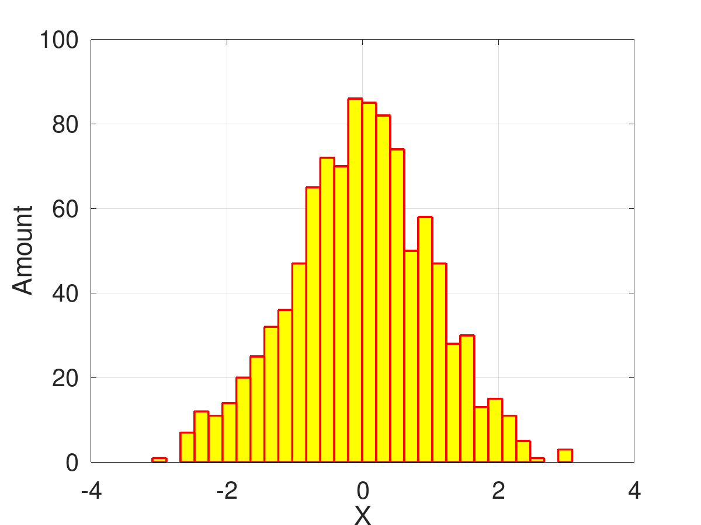

---
## Front matter
lang: ru-RU
title: Групповой проект Хищник-жертва
subtitle: Алгоритмы решения задачи
author:
  - Смирнов-Мальцев Е. Д.
institute:
  - Российский университет дружбы народов им. Патриса Лумумбу, Москва, Россия

date: 20 мая 2023

## i18n babel
babel-lang: russian
babel-otherlangs: english

## Formatting pdf
toc: false
toc-title: Содержание
slide_level: 2
aspectratio: 169
section-titles: true
theme: metropolis
header-includes:
 - \metroset{progressbar=frametitle,sectionpage=progressbar,numbering=fraction}
 - '\makeatletter'
 - '\beamer@ignorenonframefalse'
 - '\makeatother'
marp: true

style: |
  section h2 {
    text-align: center;
  }

---

# Доклад на тему

## Научные статистические расчеты.
## Программное обеспечение для реализации статистических расчётов.

---

## Докладчик

  * Смирнов-Мальцев Егор Дмитриевич
  * студент группы НКНбд-01-21
  * Российский университет дружбы народов им. Патриса Лумумбу
  * <https://github.com/EgorSmM>

---

# Вводная часть

---

## Цель работы

- Выделить задачи научной статистики,
- Выполнить подсчет основных статистических метрик.

---

## Задачи работы

- 

---

# Теоретическое введение

---

**Статистика** --- совокупность числовых показателей, характеризующих те или иные явления и процессы.

---

## Основные элементы статистического исследования

- Разработка программы статистического наблюдения,
- Создание статистической выборки,
- Обработка данных,
- Анализ полученной информации.

---

## Задачи статистического исследования

- Выявление взаимосвязей между величинами,
- Проверка гипотез на основе практических результатов.

---

## Комплекс используемых программ

Для подсчета статистических метрик в данной работе был использован `Octave` с пакетом `statistics`. Эта программная система была выбрана, поскольку:

1. Имеет совместимый с `Matlab` язык.
2. Бесплатная.

---

# Подсчет основных статистических метрик

---

## Создание случайной выборки

В качестве статистической выборки $X$ возьмем 1000 нормально распределенных случайных чисел. Построим гистограмму полученной выборки. Также создадим выборку с выбросом $Y$. Это будет выборка $X$ к которой добавлено число 100.

```c
> X = randn(1,1000);
> hist(X, 30, 'FaceColor', 'yellow', 'EdgeColor', 'red', 'LineWidth', 2);
> Y = X;
> Y(1,1001) = 100;
```

---

## Гистограмма случайной выборки

## 

---

## Подсчет среднего значения и медианы

Среднее значение и медиану можно посчитать с помощью встроенных функций `mean` и `median`:

```c
> mean(X)
ans = 0.0427
> median(X)
ans = 0.058198
> mean(Y)
ans = 0.14256
> median(Y)
ans = 0.059815
```

Как видно из эксперимента, медиана более устойчива к выбросам, чем среднее значение. Поэтому в случае если в выборке возможны выбросы, лучше использовать ее.

---

## Подсчет стандартного отклонения

Стандартное отклонение можно посчитать с помощью встроенной функции `std(x,f)`. Если параметр `f` равен $0$, то считается несмещенное отклонение. Если он равен $1$, то смещенное.

```c
> std(X,0)
ans = 1.0165
> std(X,1)
ans = 1.0160
> std(Y,0)
ans = 3.3187
> std(Y,1)
ans = 3.3170
```

---

В `Octave` есть встроенные функции для проверки статистических гипотез. В качестве примера, проверим является ли случайная величина $Y$ нормально распределенной с найденным нами средним и стандартным отклонением равным $1$.

```c
> kolmogorov_smirnov_test(Y,"norm",mean(Y),1)
pval: 0.00655609
```

`pval` --- вероятность получить такую же или более экстремальную выборку, при условии, что гипотеза верна. Если `pval` меньше критического уровня, то мы можем отвергнуть гипотезу.

---

# Выводы

Мы научились считать основные статистические метрики

---

## Список литературыы

1. Полякова В.В. Основы теоретической статистики. УрФУ. Екатеринбург, 2015.
2. GNU Octave Documentation [Электронный ресурс]. Free Software Foundation, 2023. URL: https://docs.octave.org/latest/.
3. Sharma N., Gobbert M.K. A comparative evaluation of Matlab, Octave, Freemat, 
and Scilab for research and teaching. Department of Mathematics; Statistics University of Maryland, Baltimore County, 2010. 37 с.
