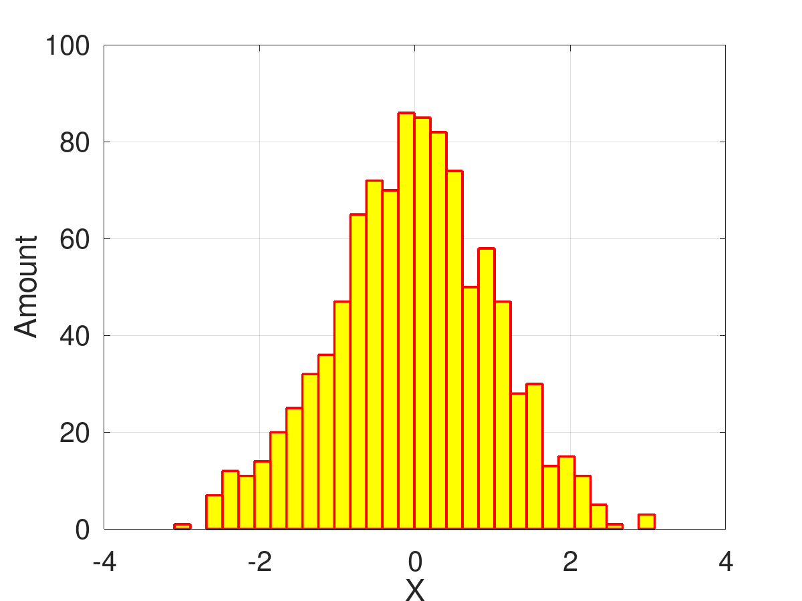

---
## Front matter
title: "Доклад"
subtitle: "Научные статистические расчеты. Программное обеспечение для реализации статистических расчётов."
author: 
  - Смирнов-Мальцев Е. Д.

## Generic otions
lang: ru-RU
toc-title: "Содержание"

## Bibliography
bibliography: bib/cite.bib
csl: pandoc/csl/gost-r-7-0-5-2008-numeric.csl

## Pdf output format
toc: true # Table of contents
toc-depth: 2
lof: true # List of figures
lot: false # List of tables
fontsize: 12pt
linestretch: 1.5
papersize: a4
documentclass: scrreprt
## I18n polyglossia
polyglossia-lang:
  name: russian
  options:
	- spelling=modern
	- babelshorthands=true
polyglossia-otherlangs:
  name: english
## I18n babel
babel-lang: russian
babel-otherlangs: english
## Fonts
mainfont: PT Serif
romanfont: PT Serif
sansfont: PT Sans
monofont: PT Mono
mainfontoptions: Ligatures=TeX
romanfontoptions: Ligatures=TeX
sansfontoptions: Ligatures=TeX,Scale=MatchLowercase
monofontoptions: Scale=MatchLowercase,Scale=0.9
## Biblatex
biblatex: true
biblio-style: "gost-numeric"
biblatexoptions:
  - parentracker=true
  - backend=biber
  - hyperref=auto
  - language=auto
  - autolang=other*
  - citestyle=gost-numeric
## Pandoc-crossref LaTeX customization
figureTitle: "Рис."
tableTitle: "Таблица"
listingTitle: "Листинг"
lofTitle: "Список иллюстраций"
lotTitle: "Список таблиц"
lolTitle: "Листинги"
## Misc options
indent: true
header-includes:
  - \usepackage{indentfirst}
  - \usepackage{float} # keep figures where there are in the text
  - \floatplacement{figure}{H} # keep figures where there are in the text
---

# Цель работы

- Выделить задачи научной статистики,
- Выполнить подсчет основных статистических метрик.

# Теоретическое введение

Статистика --- совокупность числовых показателей, характеризующих те или иные явления и процессы. Статистика имеет дело, прежде
всего с количественной стороной явлений и процессов.
Статистические данные языком цифр характеризуют размеры и
количественные соотношения (объемы, структуру, темпы развития и т.п.)
явлений и проявляющиеся в них закономерности.

Важнейшими элементами статистической методологии являются:
массовое наблюдение, группировки, применение обобщающих (сводных)
характеристик. Статистическое исследование
включает в себя:
- разработку программы статистического наблюдения (определение
объекта, единицы и формы наблюдения, разработку методик расчета
запрашиваемых показателей и предполагаемые результаты
обработки полученных данных);
- сбор массовых данных о статистической совокупности
(непосредственно статистическое наблюдение);
- обработку данных (сводку, группировку);
- анализ полученной информации.

## Комплекс используемых программ

Для подсчета статистических метрик в данной работе был использован `Octave` с пакетом `statistics`. Эта программная система была выбрана, поскольку:

1. Имеет совместимый с `Matlab` язык.
2. Бесплатная.

---

# Подсчет основных статистических метрик

## Создание случайной выборки

В качестве статистической выборки $X$ возьмем 1000 нормально распределенных случайных чисел. Построим гистограмму полученной выборки. Также создадим выборку $Y$ с выбросом. Ей будет выборка $X$ к которой добавлено число 100.

```c
> X = randn(1,1000);
> hist(X, 30, 'FaceColor', 'yellow', 'EdgeColor', 'red', 'LineWidth', 2);
> Y = X;
> Y(1,1001) = 100;
```

{ #fig:001 width=70% }

Среднее значение и медиану можно посчитать с помощью встроенных функций `mean` и `median`:

```c
> mean(X)
ans = 0.0427
> median(X)
ans = 0.058198
> mean(Y)
ans = 0.14256
> median(Y)
ans = 0.059815
```

Как видно из эксперимента, медиана более устойчива к выбросам, чем среднее значение. Поэтому в случае если в выборке возможны выбросы, лучше использовать ее.

Стандартное отклонение можно посчитать с помощью встроенной функции `std(x,f)`. Если параметр `f` равен $0$, то считается несмещенное отклонение. Если он равен $1$, то смещенное.

```c
> std(X,0)
ans = 1.0165
> std(X,1)
ans = 1.0160
> std(Y,0)
ans = 3.3187
> std(Y,1)
ans = 3.3170
```

# Проверка статистических гипотез

Важной частью статистических расчетов является проверка статистических гипотез. В качестве примера, проверим является ли случайная величина $Y$ нормально распределенной с найденным нами средним и стандартным отклонением равным $1$.

```c
> kolmogorov_smirnov_test(Y,"norm",mean(Y),1)
pval: 0.00655609
```

`pval` --- вероятность получить такую же или более экстремальную выборку, при условии, что гипотеза верна. Если `pval` меньше критического уровня, то мы можем отвергнуть гипотезу. Обычно критический уровень берут равным $0.05$. В таком случае мы можем отвергнуть гипотезу. Однако в некоторых областях используют другой критический уровень. Например, в ядерной физике используется правило 5 сигм, по которому `pval` должен быть меньше $3*10^{-7}$. В таком случае мы не можем отвергнуть нашу гипотезу.

Проверим является ли случайная величина $Y$ нормально распределенной со средним значением равным медиане $Y$ и стандартным отклонением $1$.

```c
> kolmogorov_smirnov_test(Y,"norm",median(Y),1)
pval: 0.40823
```

Эту гипотезу мы отвергнуть не можем.

# Выводы

Мы посчитали основные статистические метрики и провели проверку статистических гипотез.

# Заключение

Для исследования модели Хищник-жертва в нашей работе будут использованы метод Эйлера и методы Рунге-Кутта, а программная реализация будет выполнена в системе математических вычисленый Octave.

# Список литературы{.unnumbered}

::: {#refs}
:::
